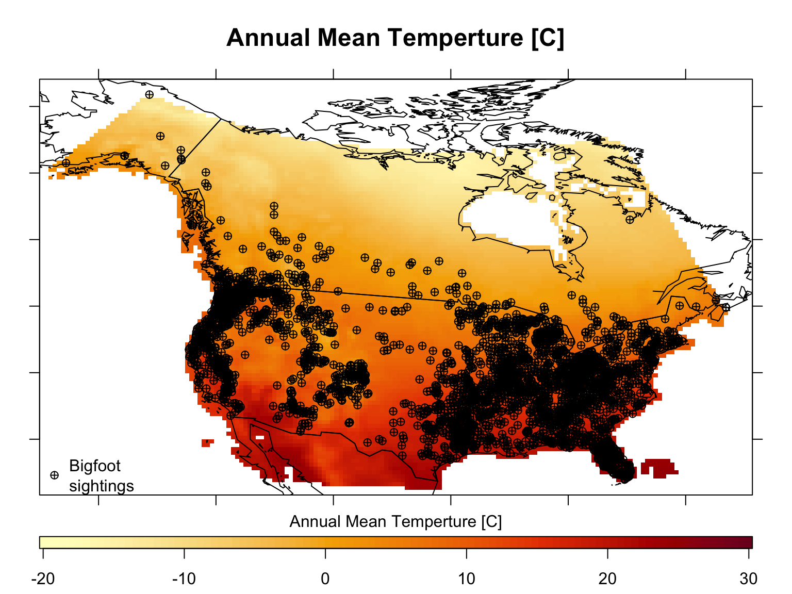

## Before you start.

This week tutorial will be a bit playful, as you will focus on plotting the distribution of a crypto‐zoological species – the North American Sasquatch, or Bigfoot (*Imaginus magnapedum*). **Supposedly**, the sasquatch belongs to a large primate lineage descended from the extinct Asian species *Gigantopithicus blacki*. Sasquatch is regularly reported in forested lands of western North America and is considered a significant indigenous American and western North American folk legend. However, the existence of this creature has never been verified with a typed specimen.

The main objective will be to generate a spatial representation of the complete range of the species. This type of analysis is the starting point to build a statistical model to describe the " environmental requirements" of a species. These models are often referred to as "species distribution modelling" (SDM) or "ecological niche modelling" (ENM). Regardless of the "tongue-in-cheek" nature of the organisms evaluated, this work will provide you with an opportunity to combine different spatial data in `R`.

Lozier et al. (2009) undertook a similar task. They build an SDM to show the need for careful evaluation of database records before their use in modelling, especially when the presence of cryptic species (*morphologically indistinguishable biological groups that are incapable of interbreeding*) is suspected, or many records are based on indirect evidence. 

## Loading and processing `Raster*` objects.

Now that you know where Bigfoot has been "sighted" across North America is time to get environmental information to define the conditions that determine the best habitats for Bigfoot. This is the objective of species distribution modelling (**SDM**). In **SDM**s, environmental information is usually extracted from `raster` files stored in some kind of GIS format. Variables can include climatic, soil, terrain, vegetation, land use, and other variables.


## Get climate data.

As a start, you will focus on climatic data for the region of interest. There are many sources of climatic information freely available to be used. Some examples are the Climatic Research Unit (CRU <http://www.cru.uea.ac.uk/>), Climatologies at high resolution for the Earth’s land surface areas (CHELSA <https://chelsa-climate.org/>), WorldClim v2. (<https://www.worldclim.org/>), ecoClimate (<https://www.ecoclimate.org/>), global climatologies for bioclimatic modelling (CliMond <https://www.climond.org/>) and climate re-analyses such as ERA5-Land (<https://bit.ly/39kQlOL>).

For simplicity, you will focus now on WorldClim climatologies and obtain the 19-bioclimatic variables commonly used in SDMs. These can be downloaded and stored locally. Some of these can be loaded directly from `R` with the use of packages. For example, WorldClim data can be obtained directly from `R` using the `getData()` function of the `raster` package. Climate data from CRU can be obtained directly from `R` using the `create_CRU_stack()` function of the `getCRUCLdata` package. For an example of how this can be done see the code below. 


```r
# Now use the function getData() to download the 19-BioClimatic part of WorldClim at a 10ArcMis resolution.
WC.Bioclim <- getData(name = 'worldclim', # Define the Data set name.
                      res = 10, ## This defines the resolution of the Imported raster (10ArcMis)
                      var = 'bio') ## This defines that BioClimatic variables are imported
```

## Visualize the climate data.

By using `getData()` you get a number of files that are downloaded into a folder named `wc10` in the working working directory. These are ESRI `.hdr` Labelled files named bio1 to bio19.

You will not do this, as I have downloaded and it and crop the area to a manageble size (the Americas) an this map is available in your session. The object name is `WC.Bioclim` as it is a `RasterStack` with 19 layers, coded `Bioclim.1` to `Bioclim.19` (see <https://www.WorldClim.org/data/bioclim.html> for a translation of the codes). But, how do they look? The only way to see that is to plot the variables.

<div class = "alert alert-info">
**Your task:**

Plot the `Bioclim.1` (Annual Mean Temperature [C]) and `Bioclim.12` (Total Annual Precipitation [mm/yr]) layers of `WC.Bioclim`.

The maps should be shown as two panels in the same figure.
</div>


<div class="tutorial-exercise" data-label="worldclimPlt" data-completion="1" data-diagnostics="1" data-startover="1" data-lines="18">

```text
# Define a plotting space with One-Row and Two-columns
---(---- = c(--, --))

# plot Annual Mean Temperature (WorldClim temp are C*10 so you need to do some operations before plotting).
plot(------, # Define the Layer from WC.Bioclim to plot. I divide the value by 10 as WorldClim temp are C*10 (to avoid using Floating Numbers)
     main = "Annual Mean Temperature\n[C]", # Set the Figure title
     cex.main = 1.2, # Define the Title font size
     col = hcl.colors(n = 50 , palette = "Blue-Red") # Define a divergent HCL palette with 50 values.
     )
# plot Total Annual Precipitation 

plot(------, # Define the Layer from WC.Bioclim to plot.
     main = "Total Annual Precipitation\n[mm/yr]", # Set the Figure title
     cex.main = 1.2,# Define the Title font size
     col = rev(hcl.colors(n = 50 ,palette = "Blue-Red")) # Define a divergent HCL palette with 50 values.
     )
```

<script type="application/json" data-ui-opts="1">{"engine":"r","has_checker":true,"caption":"<span data-i18n=\"text.enginecap\" data-i18n-opts=\"{&quot;engine&quot;:&quot;R&quot;}\">R Code<\/span>"}</script></div>

<div class="tutorial-exercise-support" data-label="worldclimPlt-solution" data-completion="1" data-diagnostics="1" data-startover="1" data-lines="0">

```text
# Define a plotting space with One-Row and Two-columns
par(mfrow = c(1, 2))
# plot Annual Mean Temperature (WorldClim temp are C*10 so you need to do some operations before plotting).
# Define a divergent blue-to-grey-to-red HCL palette with 50 values.
plot(WC.Bioclim[['Bioclim.1']]/10, # Define the Layer from WC.Bioclim to plot. I divide the value by 10 as WorldClim temp are C*10 (to avoid using Floating Numbers)
     main = "Annual Mean Temperature\n[C]", # Set the Figure title
     cex.main = 1.2, # Define the Title font size
     col = hcl.colors(n = 50 , palette = "Blue-Red") # Define a divergent HCL palette with 50 values.
     )
# plot Total Annual Precipitation 
# Define a divergent red-to-grey-to-blue HCL palette with 50 values.
plot(WC.Bioclim[['Bioclim.12']], # Define the Layer from WC.Bioclim to plot.
     main = "Total Annual Precipitation\n[mm/yr]", # Set the Figure title
     cex.main = 1.2,# Define the Title font size
     col = rev(hcl.colors(n = 50 ,palette = "Blue-Red")) # Define a divergent HCL palette with 50 values.
     )
```

</div>
<div class="tutorial-exercise-support" data-label="worldclimPlt-hint" data-completion="1" data-diagnostics="1" data-startover="1" data-lines="0">

```text
logo <- stack(system.file("external/rlogo.grd", package="raster")) 
par(mfrow=c(1,2)) # define the plotting space
plot(logo[[1]])
plot(logo[[2]])
```

</div>


## Croping  `Raster*` objects.

You have a set of predictor variables as `rasters` in the `WC.Bioclim` object. Your next task is cropping the continatal climate maps to the region of interest (North America). You could do this using the `crop()` function of the `raster` package and defining the cutting region using the `Bigfoot.SpaPnt` object.

<div class = "alert alert-info">
**Your task:**

Crop the `WC.Bioclim` raster using the spatial extent of your georeferenced observations (`Bigfoot.SpaPnt`).

After you have done this, plot the resulting `RasterLayer`.
</div>

<div class="tutorial-exercise" data-label="BioclimCrop" data-completion="1" data-diagnostics="1" data-startover="1" data-lines="10">

```text
# Crop the WC.Bioclim raster using the observations spatial extent using the crop function
NoAm.WC.Bioclim <- -----(x= ----, # Define the Raster to crop
                        y = ---- # Define the spatial object that determine the extent to be cropped
                        )
# Plot the cropped Raster
plot(----)
```

<script type="application/json" data-ui-opts="1">{"engine":"r","has_checker":true,"caption":"<span data-i18n=\"text.enginecap\" data-i18n-opts=\"{&quot;engine&quot;:&quot;R&quot;}\">R Code<\/span>"}</script></div>

<div class="tutorial-exercise-support" data-label="BioclimCrop-solution" data-completion="1" data-diagnostics="1" data-startover="1" data-lines="0">

```text
# Crop the WC.Bioclim raster using the observations spatial extent
NoAm.WC.Bioclim <- crop(x= WC.Bioclim, # Define the Raster to crop
                        y = Bigfoot.SpaPnt # Define the spatial object that determine the extent to be cropped
                        )
# Plot the cropped Raster
plot(NoAm.WC.Bioclim)
```

</div>

<div class="tutorial-exercise-support" data-label="BioclimCrop-hint" data-completion="1" data-diagnostics="1" data-startover="1" data-lines="0">

```text
r <- raster(nrow=45, ncol=90)
values(r) <- 1:ncell(r)
e <- extent(-160, 10, 30, 60)
rc <- crop(r, e)
```

</div>


## Projecting `Raster*` objects.

As you see from the plot above, the result of the `crop()` function is a subset of the 19-BIOCLIM variables for continental North America. One more thing here, the plot function in a `RasterStack` only plots up to 16-layers. However, like your first observations map, the visualisation does not look very "pretty". So the first thing to do is re-project these to an Albers Equal Area projection using the `projectRaster()` function.

<div class = "alert alert-info">
**Your task:**

Using the function `projectRaster()`, re-project your North America cropped bioclimatic variables raster (`NoAm.WC.Bioclim`) to an Albers Equal Area projection.

After you have done this, plot the resulting `RasterLayer`.
</div>

<div class="tutorial-exercise" data-label="PrjNoAmBioClim" data-completion="1" data-diagnostics="1" data-startover="1" data-lines="10">

```text
# project the NoAm.WC.Bioclim raster
NoAm.WC.Bioclim.AEA <- ------(from = ------, # Define the Raster to be projected.
                              crs = ------(------) # Define the projection as a CRS object uisng CRS.String
                              )
# Plot the re-projected Raster
------(------)
```

<script type="application/json" data-ui-opts="1">{"engine":"r","has_checker":true,"caption":"<span data-i18n=\"text.enginecap\" data-i18n-opts=\"{&quot;engine&quot;:&quot;R&quot;}\">R Code<\/span>"}</script></div>

<div class="tutorial-exercise-support" data-label="PrjNoAmBioClim-solution" data-completion="1" data-diagnostics="1" data-startover="1" data-lines="0">

```text
# project the NoAm.WC.Bioclim raster
NoAm.WC.Bioclim.AEA <- projectRaster(from = NoAm.WC.Bioclim, # Define the Raster to be projected.
                                     crs = CRS(CRS.String) # Define the projection as a CRS object.
                                     )
# Plot the re-projected Raster
plot(NoAm.WC.Bioclim.AEA)
```

</div>

<div class="tutorial-exercise-support" data-label="PrjNoAmBioClim-hint" data-completion="1" data-diagnostics="1" data-startover="1" data-lines="0">

```text
r <- raster(xmn=-110, xmx=-90, ymn=40, ymx=60, ncols=40, nrows=40)
r <- setValues(r, 1:ncell(r))
crs(r)
newproj <- "+proj=lcc +lat_1=48 +lat_2=33 +lon_0=-100 +datum=WGS84"
pr1 <- projectRaster(r, crs=newproj)
```

</div>


## Map algebra - 1

For clarity, "bioclimatic" summaries represent annual trends (e.g., mean annual temperature, annual precipitation), seasonality (e.g., annual range in temperature and precipitation) and extreme or limiting environmental factors (e.g., the temperature of the coldest and warmest month, and precipitation of the wet and dry quarters).

The best way to know what information is summarised in these variables is to build them yourself, so this is your next task. Specifically, you will now create Bioclim-7 [Temperature Annual Range] as an example.

For this, you will need the monthly maximum and minimum temperatures, which can be downloaded using the `var = 'tmin'` and `var = 'tmax'` arguments on the `getData()` function of the `raster` package. This data is now loaded in the memory.

Both `No.Am.WC.Tmin` and `No.Am.WC.Tmax` are `RasterStack`s objects with 12 bands (one for each one of the months). The first step to build a raster with the Temperature Annual Range (Bioclim-7) is to estimate the Maximum Temperature of Warmest Month (Bioclim-5) and the Minimum Temperature of Coldest Month (Bioclim-6).

These can be estimated directly on a the `RasterStack` using the `max()` and `min()` functions. Alternatively, you can use the function `calc()` from the `raster` package. This function allows for more elaborate calculations as you can define more complex functions with the data within a single cell in a multi-band raster (see `?calc` for more info on the function). 

<div class = "alert alert-info">
**Your task:**

Using the monthly minimum (`NoAm.WC.Tmin`) estimate the minimum temperature of the coldest month (the minimum value in `NoAm.WC.Tmin`) and plot it. Remmebr that temperatures here are C x 10.
</div>

<div class="tutorial-exercise" data-label="MonthTmin" data-completion="1" data-diagnostics="1" data-startover="1" data-lines="0">

```text
#Estimate the minimum temperature of coldest month 
WC.MinTCoMo <- ------(------)

#plot the minimum temperature of coldest month - dive by 10
------(------)
```

<script type="application/json" data-ui-opts="1">{"engine":"r","has_checker":true,"caption":"<span data-i18n=\"text.enginecap\" data-i18n-opts=\"{&quot;engine&quot;:&quot;R&quot;}\">R Code<\/span>"}</script></div>

<div class="tutorial-exercise-support" data-label="MonthTmin-solution" data-completion="1" data-diagnostics="1" data-startover="1" data-lines="0">

```text
#Estimate the minimum temperature of coldest month 
WC.MinTCoMo <- min(NoAm.WC.Tmin)

#plot the minimum temperature of coldest month - dive by 10
plot(WC.MinTCoMo/10)
```

</div>


<div class="tutorial-exercise-support" data-label="MonthTmin-hint" data-completion="1" data-diagnostics="1" data-startover="1" data-lines="0">

```text
logo <- stack(system.file("external/rlogo.grd", package="raster")) 
min(logo)
```

</div>

<div class = "alert alert-info">
**Your task:**

Using the monthly maximum (`NoAm.WC.Tmax`) estimate the maximum temperature of the warmest month (the maximum value in `NoAm.WC.Tmax`) and plot it.
</div>

<div class="tutorial-exercise" data-label="MonthTmax" data-completion="1" data-diagnostics="1" data-startover="1" data-lines="0">

```text
# Estimate the maximum temperature of warmest month
WC.MaxTWaMo <- -----(-----)

#plot the maximum temperature of coldest month - divide by 10
-----(-----)
```

<script type="application/json" data-ui-opts="1">{"engine":"r","has_checker":true,"caption":"<span data-i18n=\"text.enginecap\" data-i18n-opts=\"{&quot;engine&quot;:&quot;R&quot;}\">R Code<\/span>"}</script></div>

<div class="tutorial-exercise-support" data-label="MonthTmax-solution" data-completion="1" data-diagnostics="1" data-startover="1" data-lines="0">

```text
# Estimate the maximum temperature of warmest month
WC.MaxTWaMo <- max(NoAm.WC.Tmax)

#plot the maximum temperature of coldest month - divide by 10
plot(WC.MaxTWaMo/10)
```

</div>


<div class="tutorial-exercise-support" data-label="MonthTmax-hint" data-completion="1" data-diagnostics="1" data-startover="1" data-lines="0">

```text
logo <- stack(system.file("external/rlogo.grd", package="raster")) 
max(logo)
```

</div>

## Map algebra - 2

Doing the operations above transforms `NoAm.WC.Tmax` and `NoAm.WC.Tmin` from a `RasterStack` with values for each month to a `RasterLayer` that only has the maximum or minimum monthly temperature values (that is, a one layer raster).

With this information, it is now possible to generate an Annual Temperature Range (Bioclim-7) `RasterLayer`. For this, you will subtract the Minimum Temperature of Coldest Month (Bioclim-6; `WC.MinTCoMo`) from the Maximum Temperature of the Warmest Month Bioclim-5; `WC.MaxTWaMo`). This can be done using the `RasterLayer`s directly or the `calc()` function if you bundle `WC.MinTCoMo` and `WC.MaxTWaMo` in one `RasterStack`.

<div class = "alert alert-info">
**Your task:**

Using your estimates of the maximum temperature of the warmest month (`WC.MinTCoMo`) and the minimum temperature of the coldest month (`WC.MaxTWaMo`), estimate the Temperature Annual Range.

Once you have done this, plot your Temperature Annual Range estimation.
</div>


<div class="tutorial-exercise" data-label="TAnnRng" data-completion="1" data-diagnostics="1" data-startover="1" data-lines="10">

```text
# Estimate the Temperature Annual Range
WC.TAnnRng <- ------ - ------

# Plot the the Temperature Annual Range object - use a blue to red colour palette.
plot(------ , # Determine the RasterLayer to plot
     main = "Temperature Annual Range\n[c]", cex.main = 1.2, # Set the Figure title and font size
     col = hcl.colors(n = 50 ,palette = "Blue-Red") # Define a sequential colour palette. 
     )
```

<script type="application/json" data-ui-opts="1">{"engine":"r","has_checker":true,"caption":"<span data-i18n=\"text.enginecap\" data-i18n-opts=\"{&quot;engine&quot;:&quot;R&quot;}\">R Code<\/span>"}</script></div>

<div class="tutorial-exercise-support" data-label="TAnnRng-solution" data-completion="1" data-diagnostics="1" data-startover="1" data-lines="0">

```text
# Estimate the Temperature Annual Range
WC.TAnnRng <- WC.MaxTWaMo - WC.MinTCoMo

# Plot the the Temperature Annual Range object - use a blue to red colour palette.
plot(WC.TAnnRng , # Determine the RasterLayer to plot
     main = "Temperature Annual Range\n[c]", cex.main = 1.2, # Set the Figure title and font size
     col = hcl.colors(n = 50 ,palette = "Blue-Red") # Define a sequential colour palette. 
     )
```

</div>


<div class="tutorial-exercise-support" data-label="TAnnRng-hint" data-completion="1" data-diagnostics="1" data-startover="1" data-lines="0">

```text
logo <- stack(system.file("external/rlogo.grd", package="raster")) 
max(logo)-min(logo)
```

</div>


Now you know how these bioclimatic variables are generated. But the process above is long and tedious, done only to understand how raster operations work. When you face a similar task in the future, you could use the` bioclim()` function for the `dismo` package. I leave that task to the interested student.

## Graphical representation of `Raster*` objects.

Now you have a series of projected rasters that can adequately show the climatic conditions in the region of interest. You will now focus on Annual Mean Temperature (bio1) as an example of producing an "almost" publication ready map. You can do this in many (and more straightforward) ways, but here I will show you a more "laborious" approach, so you know how to use alternative plotting parameters.

The code below generates the best visualisation for Annual Mean Temperature (bio1) using the projected Bioclimatic raster (`NoAm.WC.Bioclim.AEA`) by taking the following steps: 

* Define a plotting region so that the map is bounded within a region.

* Plot the raster of Annual Mean Temperature using a Yellow-to-Red colour ramp palette, setting the minimum and maximum values for which colours should be plotted to -20 and 30.

* Add a bounding box and axes with only tick-marks.

* Add your projected map (`NoAmPoly.AEA`) of the region of interest, the projected observation points (`Bigfoot.SpaPnt.AEA`), and a legend to say what the plotted symbols are. 


```r
# Step 1: define a plotting region so that the maps do not get affected by how big is the plotting space

par(mfrow=c(1,1), 
    mar=c(2,2,4,2), # Defines the margins of the plotting space
    fig=c(0,1,0.1,1),# this argument defines a smaller figure space
    new=F) # this argument states that a blank plotting space is used 

## create a new plotting space
plot.new()

## Define the "limits" of the plotting space
plot.window(xlim = extent(Bigfoot.SpaPnt.AEA)[1:2], # get the xlim form the projected Bigfoot sightings
            ylim = extent(Bigfoot.SpaPnt.AEA)[3:4]) # get the ylim form the projected Bigfoot sightings)

# Step 2: plot the raster
## add the raster of Annual Mean Temperature
image(NoAm.WC.Bioclim.AEA[[1]]/10, # Define the Raster Layer to plot. You know why you divide by 10 here
      col = hcl.colors(100, "YlOrRd", rev = TRUE), # Define a colour ramp palette
      zlim = c(-20,30), # define the range of values to plot 
      add=T # Add this figure to the current plot?
      )
# Add a Main title manually
mtext("Annual Mean Temperture [C]", # Define the main title text
      side = 3, # Define the margin to locate the text.
      cex = 1.5, # Define the text size
      font = 2, # Define is the text is bold
      line = 1.5 # Define the lien to add the text
      )

# Step 3: Add area elements
#Add a bounding box

# Add a bounding box and the axes with ticks
box(); axis(1, labels = NA); axis(2, labels = NA); axis(3, labels = NA); axis(4, labels = NA)

# Step 4: Add other elements
# Add a map of the region of interest
# Plot the Area of interest
plot(NoAmPoly.AEA, # Define the SpatialPolygonsDataFrame to be plotted.
     add=T # Add this figure to the current plot?
     )
# Plot Bigfoot sightings
points(Bigfoot.SpaPnt.AEA, # Define the SpatialPointsDataFrame to plot.
       pch = 10, # Define the shape of the mark.
       col = "black" # Define the colour of the mark.
       )

# Add a legend to say what the symbols are - Manually
legend("bottomleft",
       pch=10,
       legend = "Bigfoot\nsightings",
       bty="n")

# Step 4: Add a colour ramp by hand
par(fig=c(0,1,0.01,0.13),# this argument defines a smaller figure space 
  mar=c(2,2,1,2),
  new=T) # this argument states that a black plotting space is used 
# Plot a matrix with all possible values
image((matrix(1:100)),
      axes=F,
      col = hcl.colors(100, "YlOrRd", rev = TRUE))
# Add a bounding box
box()
# Add an axis with the values
axis(1,
     at = seq(0,1, length.out = 6),
     labels = c(-2:3)*10)

# Add a main title.
mtext("Annual Mean Temperture [C]",
      side = 3,
      cex = 1,
      line = 0.3)
```



## Extract values from a `Raster*` object to use as predictors

The next step is to extract the values of the predictors at the locations where Bigfoot has been sighted. That is, get data about the climate that the species apparently likes. This is a very straightforward thing to do using the `extract()` function from the `raster` package. The question is which Bigfoot sighting object should you use: `Bigfoot.dta`, `Bigfoot.SpaPnt`, or `Bigfoot.SpaPnt.AEA`. The answer to this is given by the reference system of `WC.Bioclim`.

<div class = "alert alert-info">
**Your task:**

Using the function `projection()`, print the projection string of the `WC.Bioclim` raster.

</div>

<div class="tutorial-exercise" data-label="WCBioclimProj" data-completion="1" data-diagnostics="1" data-startover="1" data-lines="0">

```text
# Extract the projection
-------(-------)
```

<script type="application/json" data-ui-opts="1">{"engine":"r","has_checker":false,"caption":"<span data-i18n=\"text.enginecap\" data-i18n-opts=\"{&quot;engine&quot;:&quot;R&quot;}\">R Code<\/span>"}</script></div>
<div class="tutorial-exercise-support" data-label="WCBioclimProj-hint" data-completion="1" data-diagnostics="1" data-startover="1" data-lines="0">

```text
# Extract the projection
projection(rastObj)
```

</div>
<div class="tutorial-exercise-support" data-label="WCBioclimProj-solution" data-completion="1" data-diagnostics="1" data-startover="1" data-lines="0">

```text
# Extract the projection
projection(WC.Bioclim)
```

</div>

As you see, this is a Mercator projection, so you could use `Bigfoot.dta` or `Bigfoot.SpaPnt` to extract the values for each of the sites where Bigfoot has been sighted. If you instead used `NoAm.WC.Bioclim.AEA` as your source raster, you would need to use  `Bigfoot.SpaPnt.AEA` to get the data. With that clear, now you will extract the environmental information.

<div class = "alert alert-info">
**Your task:**

Using the function `extract()` get the values for the 19 Bioclimatic variables in `WC.Bioclim` for each Bigfoot sightings. for this use the `Bigfoot.SpaPnt` spatial object.

</div>

<div class="tutorial-exercise" data-label="WCBioclimExtrc" data-completion="1" data-diagnostics="1" data-startover="1" data-lines="0">

```text
# The same as above but using the SpatialPointDataFrame
BFC <- ------(x = ------ ,# Define the RasterStack with the Environmental information.
               y = ------ # Define the object with the locations to get the data
               )
# Print the resulting data.frame head.
head(BFC)
```

<script type="application/json" data-ui-opts="1">{"engine":"r","has_checker":true,"caption":"<span data-i18n=\"text.enginecap\" data-i18n-opts=\"{&quot;engine&quot;:&quot;R&quot;}\">R Code<\/span>"}</script></div>

<div class="tutorial-exercise-support" data-label="WCBioclimExtrc-solution" data-completion="1" data-diagnostics="1" data-startover="1" data-lines="0">

```text
# The same as above but using the SpatialPointDataFrame
BFC <- extract(x = WC.Bioclim ,# Define the RasterStack with the Environmental information.
                y = Bigfoot.SpaPnt # Define the object with the locations to get the data
                )
# Print the resulting data.frame head.
head(BFC)
```

</div>

<div class="tutorial-exercise-support" data-label="WCBioclimExtrc-hint" data-completion="1" data-diagnostics="1" data-startover="1" data-lines="0">

```text
r <- raster(ncol=36, nrow=18, vals=1:(18*36))
xy <- cbind(-50, seq(-80, 80, by=20))
extract(r, xy)
```

</div>


## Checking the Extraction of values from a `Raster*` object to use as predictors

One important check is whether there are observations with no environmental data (as these could be located in areas where the `RasterStack` has no data). You can do this using a simple `apply` loop.

<div class = "alert alert-info">
**Your task:**

Using the function `apply()`, define the sightings with no bioclimatic information (rows with `NA`).

</div>

<div class="tutorial-exercise" data-label="NoDataID" data-completion="1" data-diagnostics="1" data-startover="1" data-lines="0">

```text
# Determine the rows where the variables have NA as a value.
apply(------ ,
      MARGIN = ------, # apply the function to each column
      function(x){
        ------(------(------))})# test for each column the rows with no values
```

<script type="application/json" data-ui-opts="1">{"engine":"r","has_checker":true,"caption":"<span data-i18n=\"text.enginecap\" data-i18n-opts=\"{&quot;engine&quot;:&quot;R&quot;}\">R Code<\/span>"}</script></div>


The code above shows that rows 3595 and 3682 do not have environmental data. To see where they are, you can plot the "nice map" again but this time modifying the `points()` function to mark the locations with no environmental data.

<div class = "alert alert-info">
**Your task:**

Plot the "nice map" , modifying the `points()` function to mark the locations with no environmental data as black filled points.

</div>

<div class="tutorial-exercise" data-label="NoDataPlot" data-completion="1" data-diagnostics="1" data-startover="1" data-lines="20">

```text
#Plot the are of interest, observations and Latitudes and Longitudes lines
## define the plotting area
par(mar = c(2, 2, 6, 2), xaxs = "i", yaxs = "i")
# Plot the Area of interest
plot(NoAmPoly.AEA, 
     col = 'lightgrey', # make the continual areas light-grey
     bg = 'lightblue', # Make the oceans blue
     xlim = range(coordinates(Bigfoot.SpaPnt.AEA)[, 1]), # Set limits to zoom into the region with points
     ylim = range(coordinates(Bigfoot.SpaPnt.AEA)[, 2]), # Set limits to zoom into the region with points
     main = "Bigfoot sigthings\n[1869 to 2017]", 
     cex.main = 1.2)
box()
# Add some tick marks to define the latitude-longitude point
# Note that these commands are separated with a semicolon (this allows to put consecutive functions in one line)
axis(1, labels = NA); axis(2, labels = NA); axis(3, labels = NA); axis(4, labels = NA)
# Plot Bigfoot sightings
points(Bigfoot.SpaPnt.AEA ,
       pch=19,
       col = "red")
## Show the sites with no environmental data
points(Bigfoot.SpaPnt.AEA[c(3595, 3682), ] ,
       pch = 19, 
       cex=1.5,
       col = "black")
```

<script type="application/json" data-ui-opts="1">{"engine":"r","has_checker":false,"caption":"<span data-i18n=\"text.enginecap\" data-i18n-opts=\"{&quot;engine&quot;:&quot;R&quot;}\">R Code<\/span>"}</script></div>

This figure shows that a couple of points in North Carolina do not have environmental data and should be removed from the analysis.

## Last Points.

The work you have done today is the type of work you would do in an actual project. You have explored your observations and predictors, then matched these two together, and finally generated a model to test a hypothesis and make some predictions.
preserve8790ab8157a193f4
preserveb0a47ac6c1dd6975
preserve571956f05599f04c
preserve3f8cb33a5e369614
preserve005cb25f063543d2
preserve23e5e0d8a0e43b65
preserve8d04b7df34fc1c85
preserve213abce60ececafc
preserve24c58971aa18b90c
preservee12d616e7afaa1d8
preserve0b63a07f4e6593cf
preservec63d7817e7f5b282
preservef78c4d22fa72ee3c
preserve4c87aee570cfe17a
preserve9cbad3dcc3fef030
preserveeca4e551d06192b4
preserve5f6818223e5c9ee8
preserve526f5ce8fe0a17cc
preserve10c907763aa49e5f
preservede2999d0b69e0151
preserve68763b0ff5baae8e
preserveb410cf2c907c5272
preserve239af2d78f163067
preserve77f4272c0c78f866
preserve96733ad5b94da3a5

<!--html_preserve-->
<script type="application/shiny-prerendered" data-context="dependencies">
{"type":"list","attributes":{},"value":[{"type":"list","attributes":{"names":{"type":"character","attributes":{},"value":["name","version","src","meta","script","stylesheet","head","attachment","package","all_files","pkgVersion"]},"class":{"type":"character","attributes":{},"value":["html_dependency"]}},"value":[{"type":"character","attributes":{},"value":["header-attrs"]},{"type":"character","attributes":{},"value":["2.14"]},{"type":"list","attributes":{"names":{"type":"character","attributes":{},"value":["file"]}},"value":[{"type":"character","attributes":{},"value":["rmd/h/pandoc"]}]},{"type":"NULL"},{"type":"character","attributes":{},"value":["header-attrs.js"]},{"type":"NULL"},{"type":"NULL"},{"type":"NULL"},{"type":"character","attributes":{},"value":["rmarkdown"]},{"type":"logical","attributes":{},"value":[true]},{"type":"character","attributes":{},"value":["2.14"]}]},{"type":"list","attributes":{"names":{"type":"character","attributes":{},"value":["name","version","src","meta","script","stylesheet","head","attachment","package","all_files","pkgVersion"]},"class":{"type":"character","attributes":{},"value":["html_dependency"]}},"value":[{"type":"character","attributes":{},"value":["jquery"]},{"type":"character","attributes":{},"value":["3.6.0"]},{"type":"list","attributes":{"names":{"type":"character","attributes":{},"value":["file"]}},"value":[{"type":"character","attributes":{},"value":["lib/3.6.0"]}]},{"type":"NULL"},{"type":"character","attributes":{},"value":["jquery-3.6.0.min.js"]},{"type":"NULL"},{"type":"NULL"},{"type":"NULL"},{"type":"character","attributes":{},"value":["jquerylib"]},{"type":"logical","attributes":{},"value":[true]},{"type":"character","attributes":{},"value":["0.1.4"]}]},{"type":"list","attributes":{"names":{"type":"character","attributes":{},"value":["name","version","src","meta","script","stylesheet","head","attachment","package","all_files","pkgVersion"]},"class":{"type":"character","attributes":{},"value":["html_dependency"]}},"value":[{"type":"character","attributes":{},"value":["bootstrap"]},{"type":"character","attributes":{},"value":["3.3.5"]},{"type":"list","attributes":{"names":{"type":"character","attributes":{},"value":["file"]}},"value":[{"type":"character","attributes":{},"value":["rmd/h/bootstrap"]}]},{"type":"list","attributes":{"names":{"type":"character","attributes":{},"value":["viewport"]}},"value":[{"type":"character","attributes":{},"value":["width=device-width, initial-scale=1"]}]},{"type":"character","attributes":{},"value":["js/bootstrap.min.js","shim/html5shiv.min.js","shim/respond.min.js"]},{"type":"character","attributes":{},"value":["css/cerulean.min.css"]},{"type":"character","attributes":{},"value":["<style>h1 {font-size: 34px;}\n       h1.title {font-size: 38px;}\n       h2 {font-size: 30px;}\n       h3 {font-size: 24px;}\n       h4 {font-size: 18px;}\n       h5 {font-size: 16px;}\n       h6 {font-size: 12px;}\n       code {color: inherit; background-color: rgba(0, 0, 0, 0.04);}\n       pre:not([class]) { background-color: white }<\/style>"]},{"type":"NULL"},{"type":"character","attributes":{},"value":["rmarkdown"]},{"type":"logical","attributes":{},"value":[true]},{"type":"character","attributes":{},"value":["2.14"]}]},{"type":"list","attributes":{"names":{"type":"character","attributes":{},"value":["name","version","src","meta","script","stylesheet","head","attachment","package","all_files","pkgVersion"]},"class":{"type":"character","attributes":{},"value":["html_dependency"]}},"value":[{"type":"character","attributes":{},"value":["pagedtable"]},{"type":"character","attributes":{},"value":["1.1"]},{"type":"list","attributes":{"names":{"type":"character","attributes":{},"value":["file"]}},"value":[{"type":"character","attributes":{},"value":["rmd/h/pagedtable-1.1"]}]},{"type":"NULL"},{"type":"character","attributes":{},"value":["js/pagedtable.js"]},{"type":"character","attributes":{},"value":["css/pagedtable.css"]},{"type":"NULL"},{"type":"NULL"},{"type":"character","attributes":{},"value":["rmarkdown"]},{"type":"logical","attributes":{},"value":[true]},{"type":"character","attributes":{},"value":["2.14"]}]},{"type":"list","attributes":{"names":{"type":"character","attributes":{},"value":["name","version","src","meta","script","stylesheet","head","attachment","package","all_files","pkgVersion"]},"class":{"type":"character","attributes":{},"value":["html_dependency"]}},"value":[{"type":"character","attributes":{},"value":["highlightjs"]},{"type":"character","attributes":{},"value":["9.12.0"]},{"type":"list","attributes":{"names":{"type":"character","attributes":{},"value":["file"]}},"value":[{"type":"character","attributes":{},"value":["rmd/h/highlightjs"]}]},{"type":"NULL"},{"type":"character","attributes":{},"value":["highlight.js"]},{"type":"character","attributes":{},"value":["textmate.css"]},{"type":"NULL"},{"type":"NULL"},{"type":"character","attributes":{},"value":["rmarkdown"]},{"type":"logical","attributes":{},"value":[true]},{"type":"character","attributes":{},"value":["2.14"]}]},{"type":"list","attributes":{"names":{"type":"character","attributes":{},"value":["name","version","src","meta","script","stylesheet","head","attachment","package","all_files","pkgVersion"]},"class":{"type":"character","attributes":{},"value":["html_dependency"]}},"value":[{"type":"character","attributes":{},"value":["tutorial"]},{"type":"character","attributes":{},"value":["0.10.5.9000"]},{"type":"list","attributes":{"names":{"type":"character","attributes":{},"value":["file"]}},"value":[{"type":"character","attributes":{},"value":["lib/tutorial"]}]},{"type":"NULL"},{"type":"character","attributes":{},"value":["tutorial.js"]},{"type":"character","attributes":{},"value":["tutorial.css"]},{"type":"NULL"},{"type":"NULL"},{"type":"character","attributes":{},"value":["learnr"]},{"type":"logical","attributes":{},"value":[true]},{"type":"character","attributes":{},"value":["0.10.5.9000"]}]},{"type":"list","attributes":{"names":{"type":"character","attributes":{},"value":["name","version","src","meta","script","stylesheet","head","attachment","package","all_files","pkgVersion"]},"class":{"type":"character","attributes":{},"value":["html_dependency"]}},"value":[{"type":"character","attributes":{},"value":["i18n"]},{"type":"character","attributes":{},"value":["21.6.10"]},{"type":"list","attributes":{"names":{"type":"character","attributes":{},"value":["file"]}},"value":[{"type":"character","attributes":{},"value":["lib/i18n"]}]},{"type":"NULL"},{"type":"character","attributes":{},"value":["i18next.min.js","tutorial-i18n-init.js"]},{"type":"NULL"},{"type":"character","attributes":{},"value":["<script id=\"i18n-cstm-trns\" type=\"application/json\">{\"language\":\"en\",\"resources\":{\"en\":{\"translation\":{\"button\":{\"runcode\":\"Run Code\",\"runcodetitle\":\"$t(button.runcode) ({{kbd}})\",\"hint\":\"Hint\",\"hint_plural\":\"Hints\",\"hinttitle\":\"$t(button.hint)\",\"hintnext\":\"Next Hint\",\"hintprev\":\"Previous Hint\",\"solution\":\"Solution\",\"solutiontitle\":\"$t(button.solution)\",\"copyclipboard\":\"Copy to Clipboard\",\"startover\":\"Start Over\",\"startovertitle\":\"$t(button.startover)\",\"continue\":\"Continue\",\"submitanswer\":\"Submit Answer\",\"submitanswertitle\":\"$t(button.submitanswer)\",\"previoustopic\":\"Previous Topic\",\"nexttopic\":\"Next Topic\",\"questionsubmit\":\"$t(button.submitanswer)\",\"questiontryagain\":\"Try Again\"},\"text\":{\"startover\":\"Start Over\",\"areyousure\":\"Are you sure you want to start over? (all exercise progress will be reset)\",\"youmustcomplete\":\"You must complete the\",\"exercise\":\"exercise\",\"exercise_plural\":\"exercises\",\"inthissection\":\"in this section before continuing.\",\"code\":\"Code\",\"enginecap\":\"{{engine}} $t(text.code)\",\"quiz\":\"Quiz\",\"blank\":\"blank\",\"blank_plural\":\"blanks\",\"exercisecontainsblank\":\"This exercise contains {{count}} $t(text.blank).\",\"pleasereplaceblank\":\"Please replace {{blank}} with valid code.\",\"unparsable\":\"It looks like this might not be valid R code. R cannot determine how to turn your text into a complete command. You may have forgotten to fill in a blank, to remove an underscore, to include a comma between arguments, or to close an opening <code>&quot;<\\/code>, <code>'<\\/code>, <code>(<\\/code> or <code>{<\\/code> with a matching <code>&quot;<\\/code>, <code>'<\\/code>, <code>)<\\/code> or <code>}<\\/code>.\\n\",\"unparsablequotes\":\"<p>It looks like your R code contains specially formatted quotation marks or &quot;curly&quot; quotes (<code>{{character}}<\\/code>) around character strings, making your code invalid. R requires character values to be contained in straight quotation marks (<code>&quot;<\\/code> or <code>'<\\/code>).<\\/p> {{code}} <p>Don't worry, this is a common source of errors when you copy code from another app that applies its own formatting to text. You can try replacing the code on that line with the following. There may be other places that need to be fixed, too.<\\/p> {{suggestion}}\\n\",\"unparsableunicode\":\"<p>It looks like your R code contains an unexpected special character (<code>{{character}}<\\/code>) that makes your code invalid.<\\/p> {{code}} <p>Sometimes your code may contain a special character that looks like a regular character, especially if you copy and paste the code from another app. Try deleting the special character from your code and retyping it manually.<\\/p>\\n\",\"unparsableunicodesuggestion\":\"<p>It looks like your R code contains an unexpected special character (<code>{{character}}<\\/code>) that makes your code invalid.<\\/p> {{code}} <p>Sometimes your code may contain a special character that looks like a regular character, especially if you copy and paste the code from another app. You can try replacing the code on that line with the following. There may be other places that need to be fixed, too.<\\/p> {{suggestion}}\\n\",\"and\":\"and\",\"or\":\"or\",\"listcomma\":\", \",\"oxfordcomma\":\",\"}}},\"fr\":{\"translation\":{\"button\":{\"runcode\":\"Lancer le Code\",\"runcodetitle\":\"$t(button.runcode) ({{kbd}})\",\"hint\":\"Indication\",\"hint_plural\":\"Indications\",\"hinttitle\":\"$t(button.hint)\",\"hintnext\":\"Indication Suivante\",\"hintprev\":\"Indication Précédente\",\"solution\":\"Solution\",\"solutiontitle\":\"$t(button.solution)\",\"copyclipboard\":\"Copier dans le Presse-papier\",\"startover\":\"Recommencer\",\"startovertitle\":\"$t(button.startover)\",\"continue\":\"Continuer\",\"submitanswer\":\"Soumettre\",\"submitanswertitle\":\"$t(button.submitanswer)\",\"previoustopic\":\"Chapitre Précédent\",\"nexttopic\":\"Chapitre Suivant\",\"questionsubmit\":\"$t(button.submitanswer)\",\"questiontryagain\":\"Réessayer\"},\"text\":{\"startover\":\"Recommencer\",\"areyousure\":\"Êtes-vous certains de vouloir recommencer? (La progression sera remise à zéro)\",\"youmustcomplete\":\"Vous devez d'abord compléter\",\"exercise\":\"l'exercice\",\"exercise_plural\":\"des exercices\",\"inthissection\":\"de cette section avec de continuer.\",\"code\":\"Code\",\"enginecap\":\"$t(text.code) {{engine}}\",\"quiz\":\"Quiz\",\"and\":\"et\",\"or\":\"ou\",\"oxfordcomma\":\"\"}}},\"es\":{\"translation\":{\"button\":{\"runcode\":\"Ejecutar código\",\"runcodetitle\":\"$t(button.runcode) ({{kbd}})\",\"hint\":\"Pista\",\"hint_plural\":\"Pistas\",\"hinttitle\":\"$t(button.hint)\",\"hintnext\":\"Siguiente pista\",\"hintprev\":\"Pista anterior\",\"solution\":\"Solución\",\"solutiontitle\":\"$t(button.solution)\",\"copyclipboard\":\"Copiar al portapapeles\",\"startover\":\"Reiniciar\",\"startovertitle\":\"$t(button.startover)\",\"continue\":\"Continuar\",\"submitanswer\":\"Enviar respuesta\",\"submitanswertitle\":\"$t(button.submitanswer)\",\"previoustopic\":\"Tema anterior\",\"nexttopic\":\"Tema siguiente\",\"questionsubmit\":\"$t(button.submitanswer)\",\"questiontryagain\":\"Volver a intentar\"},\"text\":{\"startover\":\"Reiniciar\",\"areyousure\":\"¿De verdad quieres empezar de nuevo? (todo el progreso del ejercicio se perderá)\",\"youmustcomplete\":\"Debes completar\",\"exercise\":\"el ejercicio\",\"exercise_plural\":\"los ejercicios\",\"inthissection\":\"en esta sección antes de continuar.\",\"code\":\"Código\",\"enginecap\":\"$t(text.code) {{engine}}\",\"quiz\":\"Cuestionario\",\"and\":\"y\",\"or\":\"o\",\"oxfordcomma\":\"\"}}},\"pt\":{\"translation\":{\"button\":{\"runcode\":\"Executar código\",\"runcodetitle\":\"$t(button.runcode) ({{kbd}})\",\"hint\":\"Dica\",\"hint_plural\":\"Dicas\",\"hinttitle\":\"$t(button.hint)\",\"hintnext\":\"Próxima dica\",\"hintprev\":\"Dica anterior\",\"solution\":\"Solução\",\"solutiontitle\":\"$t(button.solution)\",\"copyclipboard\":\"Copiar para a área de transferência\",\"startover\":\"Reiniciar\",\"startovertitle\":\"$t(button.startover)\",\"continue\":\"Continuar\",\"submitanswer\":\"Enviar resposta\",\"submitanswertitle\":\"$t(button.submitanswer)\",\"previoustopic\":\"Tópico anterior\",\"nexttopic\":\"Próximo tópico\",\"questionsubmit\":\"$t(button.submitanswer)\",\"questiontryagain\":\"Tentar novamente\"},\"text\":{\"startover\":\"Reiniciar\",\"areyousure\":\"Tem certeza que deseja começar novamente? (todo o progresso feito será perdido)\",\"youmustcomplete\":\"Você deve completar\",\"exercise\":\"o exercício\",\"exercise_plural\":\"os exercícios\",\"inthissection\":\"nesta seção antes de continuar.\",\"code\":\"Código\",\"enginecap\":\"$t(text.code) {{engine}}\",\"quiz\":\"Quiz\",\"and\":\"e\",\"or\":\"ou\",\"oxfordcomma\":\"\"}}},\"tr\":{\"translation\":{\"button\":{\"runcode\":\"Çalıştırma Kodu\",\"runcodetitle\":\"$t(button.runcode) ({{kbd}})\",\"hint\":\"Ipucu\",\"hint_plural\":\"İpuçları\",\"hinttitle\":\"$t(button.hint)\",\"hintnext\":\"Sonraki İpucu\",\"hintprev\":\"Önceki İpucu\",\"solution\":\"Çözüm\",\"solutiontitle\":\"$t(button.solution)\",\"copyclipboard\":\"Pano'ya Kopyala\",\"startover\":\"Baştan Başlamak\",\"startovertitle\":\"$t(button.startover)\",\"continue\":\"Devam et\",\"submitanswer\":\"Cevabı onayla\",\"submitanswertitle\":\"$t(button.submitanswer)\",\"previoustopic\":\"Önceki Konu\",\"nexttopic\":\"Sonraki Konu\",\"questionsubmit\":\"$t(button.submitanswer)\",\"questiontryagain\":\"Tekrar Deneyin\"},\"text\":{\"startover\":\"Baştan Başlamak\",\"areyousure\":\"Baştan başlamak istediğinizden emin misiniz? (tüm egzersiz ilerlemesi kaybolacak)\",\"youmustcomplete\":\"Tamamlamalısın\",\"exercise\":\"egzersiz\",\"exercise_plural\":\"egzersizler\",\"inthissection\":\"devam etmeden önce bu bölümde\",\"code\":\"Kod\",\"enginecap\":\"$t(text.code) {{engine}}\",\"quiz\":\"Sınav\",\"oxfordcomma\":\"\"}}},\"emo\":{\"translation\":{\"button\":{\"runcode\":\"🏃\",\"runcodetitle\":\"$t(button.runcode) ({{kbd}})\",\"hint\":\"💡\",\"hint_plural\":\"$t(button.hint)\",\"hinttitle\":\"$t(button.hint)\",\"solution\":\"🎯\",\"solutiontitle\":\"$t(button.solution)\",\"copyclipboard\":\"📋\",\"startover\":\"⏮\",\"startovertitle\":\"Start Over\",\"continue\":\"✅\",\"submitanswer\":\"🆗\",\"submitanswertitle\":\"Submit Answer\",\"previoustopic\":\"⬅\",\"nexttopic\":\"➡\",\"questionsubmit\":\"$t(button.submitanswer)\",\"questiontryagain\":\"🔁\"},\"text\":{\"startover\":\"⏮\",\"areyousure\":\"🤔\",\"youmustcomplete\":\"⚠️ 👉 🧑‍💻\",\"exercise\":\"\",\"exercise_plural\":\"\",\"inthissection\":\"\",\"code\":\"💻\",\"enginecap\":\"$t(text.code) {{engine}}\",\"oxfordcomma\":\"\"}}},\"eu\":{\"translation\":{\"button\":{\"runcode\":\"Kodea egikaritu\",\"runcodetitle\":\"$t(button.runcode) ({{kbd}})\",\"hint\":\"Laguntza\",\"hint_plural\":\"Laguntza\",\"hinttitle\":\"$t(button.hint)\",\"hintnext\":\"Aurreko laguntza\",\"hintprev\":\"Hurrengo laguntza\",\"solution\":\"Ebazpena\",\"solutiontitle\":\"$t(button.solution)\",\"copyclipboard\":\"Arbelean kopiatu\",\"startover\":\"Berrabiarazi\",\"startovertitle\":\"$t(button.startover)\",\"continue\":\"Jarraitu\",\"submitanswer\":\"Erantzuna bidali\",\"submitanswertitle\":\"$t(button.submitanswer)\",\"previoustopic\":\"Aurreko atala\",\"nexttopic\":\"Hurrengo atala\",\"questionsubmit\":\"$t(button.submitanswer)\",\"questiontryagain\":\"Berriro saiatu\"},\"text\":{\"startover\":\"Berrabiarazi\",\"areyousure\":\"Berriro hasi nahi duzu? (egindako lana galdu egingo da)\",\"youmustcomplete\":\"Aurrera egin baino lehen atal honetako\",\"exercise\":\"ariketa egin behar duzu.\",\"exercise_plural\":\"ariketak egin behar dituzu.\",\"inthissection\":\"\",\"code\":\"Kodea\",\"enginecap\":\"$t(text.code) {{engine}}\",\"quiz\":\"Galdetegia\",\"oxfordcomma\":\"\"}}},\"de\":{\"translation\":{\"button\":{\"runcode\":\"Code ausführen\",\"runcodetitle\":\"$t(button.runcode) ({{kbd}})\",\"hint\":\"Tipp\",\"hint_plural\":\"Tipps\",\"hinttitle\":\"$t(button.hint)\",\"hintnext\":\"Nächster Tipp\",\"hintprev\":\"Vorheriger Tipp\",\"solution\":\"Lösung\",\"solutiontitle\":\"$t(button.solution)\",\"copyclipboard\":\"In die Zwischenablage kopieren\",\"startover\":\"Neustart\",\"startovertitle\":\"$t(button.startover)\",\"continue\":\"Weiter\",\"submitanswer\":\"Antwort einreichen\",\"submitanswertitle\":\"$t(button.submitanswer)\",\"previoustopic\":\"Vorheriges Kapitel\",\"nexttopic\":\"Nächstes Kapitel\",\"questionsubmit\":\"$t(button.submitanswer)\",\"questiontryagain\":\"Nochmal versuchen\"},\"text\":{\"startover\":\"Neustart\",\"areyousure\":\"Bist du sicher, dass du neustarten willst? (der gesamte Lernfortschritt wird gelöscht)\",\"youmustcomplete\":\"Vervollstädinge\",\"exercise\":\"die Übung\",\"exercise_plural\":\"die Übungen\",\"inthissection\":\"in diesem Kapitel, bevor du fortfährst.\",\"code\":\"Code\",\"enginecap\":\"$t(text.code) {{engine}}\",\"quiz\":\"Quiz\",\"blank\":\"Lücke\",\"blank_plural\":\"Lücken\",\"pleasereplaceblank\":\"Bitte ersetze {{blank}} mit gültigem Code.\",\"unparsable\":\"Dies scheint kein gültiger R Code zu sein. R kann deinen Text nicht in einen gültigen Befehl übersetzen. Du hast vielleicht vergessen, die Lücke zu füllen, einen Unterstrich zu entfernen, ein Komma zwischen Argumente zu setzen oder ein eröffnendes <code>&quot;<\\/code>, <code>'<\\/code>, <code>(<\\/code> oder <code>{<\\/code> mit einem zugehörigen <code>&quot;<\\/code>, <code>'<\\/code>, <code>)<\\/code> oder <code>}<\\/code> zu schließen.\\n\",\"and\":\"und\",\"or\":\"oder\",\"listcomma\":\", \",\"oxfordcomma\":\",\"}}},\"ko\":{\"translation\":{\"button\":{\"runcode\":\"코드 실행\",\"runcodetitle\":\"$t(button.runcode) ({{kbd}})\",\"hint\":\"힌트\",\"hint_plural\":\"힌트들\",\"hinttitle\":\"$t(button.hint)\",\"hintnext\":\"다음 힌트\",\"hintprev\":\"이전 힌트\",\"solution\":\"솔루션\",\"solutiontitle\":\"$t(button.solution)\",\"copyclipboard\":\"클립보드에 복사\",\"startover\":\"재학습\",\"startovertitle\":\"$t(button.startover)\",\"continue\":\"다음 학습으로\",\"submitanswer\":\"정답 제출\",\"submitanswertitle\":\"$t(button.submitanswer)\",\"previoustopic\":\"이전 토픽\",\"nexttopic\":\"다음 토픽\",\"questionsubmit\":\"$t(button.submitanswer)\",\"questiontryagain\":\"재시도\"},\"text\":{\"startover\":\"재학습\",\"areyousure\":\"다시 시작 하시겠습니까? (모든 예제의 진행 정보가 재설정됩니다)\",\"youmustcomplete\":\"당신은 완료해야 합니다\",\"exercise\":\"연습문제\",\"exercise_plural\":\"연습문제들\",\"inthissection\":\"이 섹션을 실행하기 전에\",\"code\":\"코드\",\"enginecap\":\"$t(text.code) {{engine}}\",\"quiz\":\"퀴즈\",\"blank\":\"공백\",\"blank_plural\":\"공백들\",\"exercisecontainsblank\":\"이 연습문제에는 {{count}}개의 $t(text.blank)이 포함되어 있습니다.\",\"pleasereplaceblank\":\"{{blank}}를 유효한 코드로 바꾸십시오.\",\"unparsable\":\"이것은 유효한 R 코드가 아닐 수 있습니다. R은 텍스트를 완전한 명령으로 변환하는 방법을 결정할 수 없습니다. 당신은 공백이나 밑줄을 대체하여 채우기, 인수를 컴마로 구분하기, 또는 <code>&quot;<\\/code>, <code>'<\\/code>, <code>(<\\/code> , <code>{<\\/code>로 시작하는 구문을 닫는 <code>&quot;<\\/code>, <code>'<\\/code>, <code>)<\\/code>, <code>}<\\/code>을 잊었을 수도 있습니다.\\n\",\"and\":\"그리고\",\"or\":\"혹은\",\"listcomma\":\", \",\"oxfordcomma\":\"\"}}},\"zh\":{\"translation\":{\"button\":{\"runcode\":\"运行代码\",\"runcodetitle\":\"$t(button.runcode) ({{kbd}})\",\"hint\":\"提示\",\"hint_plural\":\"提示\",\"hinttitle\":\"$t(button.hint)\",\"hintnext\":\"下一个提示\",\"hintprev\":\"上一个提示\",\"solution\":\"答案\",\"solutiontitle\":\"$t(button.solution)\",\"copyclipboard\":\"复制到剪切板\",\"startover\":\"重新开始\",\"startovertitle\":\"$t(button.startover)\",\"continue\":\"继续\",\"submitanswer\":\"提交答案\",\"submitanswertitle\":\"$t(button.submitanswer)\",\"previoustopic\":\"上一专题\",\"nexttopic\":\"下一专题\",\"questionsubmit\":\"$t(button.submitanswer)\",\"questiontryagain\":\"再试一次\"},\"text\":{\"startover\":\"重置\",\"areyousure\":\"你确定要重新开始吗? (所有当前进度将被重置)\",\"youmustcomplete\":\"你必须完成\",\"exercise\":\"练习\",\"exercise_plural\":\"练习\",\"inthissection\":\"在进行本节之前\",\"code\":\"代码\",\"enginecap\":\"$t(text.code) {{engine}}\",\"quiz\":\"测试\",\"blank\":\"空\",\"blank_plural\":\"空\",\"exercisecontainsblank\":\"本练习包含{{count}}个$t(text.blank)\",\"pleasereplaceblank\":\"请在{{blank}}内填写恰当的代码\",\"unparsable\":\"这似乎不是有效的R代码。 R不知道如何将您的文本转换为完整的命令。 您是否忘了填空，忘了删除下划线，忘了在参数之间包含逗号，或者是忘了用<code>&quot;<\\/code>, <code>'<\\/code>, <code>)<\\/code>,<code>}<\\/code>来封闭<code>&quot;<\\/code>, <code>'<\\/code>, <code>(<\\/code>。 or <code>{<\\/code>。\\n\",\"unparsablequotes\":\"<p>您的R代码中似乎含有特殊格式的引号，或者弯引号(<code>{{character}}<\\/code>) 在字符串前后，在R中字符串应该被直引号(<code>&quot;<\\/code> 或者 <code>'<\\/code>)包裹。<\\/p> {{code}} <p>别担心，该错误经常在复制粘贴包含格式的代码时遇到， 您可以尝试将该行中的代码替换为以下代码，也许还有其他地方需要修改。<\\/p> {{suggestion}}\\n\",\"unparsableunicode\":\"<p>您的代码中似乎包含有异常字符(<code>{{character}}<\\/code>),导致代码无效。<\\/p> {{code}} <p>有时候你的代码可能含有看似正常字符的特殊字符，特别是当你复制粘贴其他来源代码的时候。 请试着删除这些特殊字符,重新输入<\\/p>\\n\",\"unparsableunicodesuggestion\":\"<p>您的代码中似乎包含有异常字符(<code>{{character}}<\\/code>),导致代码无效。<\\/p> {{code}} <p>有时候你的代码可能含有看似正常字符的特殊字符，特别是当你复制粘贴其他来源代码的时候。 请试着删除这些特殊字符,重新输入<\\/p>\\n\",\"and\":\"且\",\"or\":\"或\",\"listcomma\":\",\",\"oxfordcomma\":\",\"}}},\"pl\":{\"translation\":{\"button\":{\"runcode\":\"Uruchom kod\",\"runcodetitle\":\"$t(button.runcode) ({{kbd}})\",\"hint\":\"Podpowiedź\",\"hint_plural\":\"Podpowiedzi\",\"hinttitle\":\"$t(button.hint)\",\"hintnext\":\"Następna podpowiedź\",\"hintprev\":\"Poprzednia podpowiedź\",\"solution\":\"Rozwiązanie\",\"solutiontitle\":\"$t(button.solution)\",\"copyclipboard\":\"Kopiuj do schowka\",\"startover\":\"Zacznij od początku\",\"startovertitle\":\"$t(button.startover)\",\"continue\":\"Kontynuuj\",\"submitanswer\":\"Wyślij\",\"submitanswertitle\":\"$t(button.submitanswer)\",\"previoustopic\":\"Poprzednia sekcja\",\"nexttopic\":\"Następna sekcja\",\"questionsubmit\":\"$t(button.submitanswer)\",\"questiontryagain\":\"Spróbuj ponownie\"},\"text\":{\"startover\":\"Zacznij od początku\",\"areyousure\":\"Czy na pewno chcesz zacząć od początku? (cały postęp w zadaniu zostanie utracony)\",\"youmustcomplete\":\"Musisz ukończyć\",\"exercise\":\"ćwiczenie\",\"exercise_plural\":\"ćwiczenia\",\"inthissection\":\"w tej sekcji przed kontynuowaniem\",\"code\":\"Kod\",\"enginecap\":\"$t(text.code) {{engine}}\",\"quiz\":\"Quiz\",\"blank\":\"luka\",\"blank_plural\":\"luk(i)\",\"exercisecontainsblank\":\"To ćwiczenie zawiera {{count}} $t(text.blank).\",\"pleasereplaceblank\":\"Proszę uzupełnić {{blank}} prawidłowym kodem.\",\"unparsable\":\"Wygląda na to, że może to nie być prawidłowy kod R. R nie jest w stanie przetworzyć Twojego tekstu na polecenie. Mogłeś(-aś) zapomnieć wypełnić luki, usunąć podkreślnik, umieścić przecinka między argumentami, lub zamknąć znak <code>&quot;<\\/code>, <code>'<\\/code>, <code>(<\\/code> lub <code>{<\\/code> odpowiadającym <code>&quot;<\\/code>, <code>'<\\/code>, <code>)<\\/code> lub <code>}<\\/code>.\\n\",\"unparsablequotes\":\"<p>Wygląda na to, że Twój kod zawiera szczególnie sformatowane cudzysłowy lub cudzysłowy typograficzne (<code>{{character}}<\\/code>) przy ciągach znaków, co sprawia, że kod jest niepoprawny. R wymaga cudzysłowów prostych (<code>&quot;<\\/code> albo <code>'<\\/code>).<\\/p> {{code}} <p>Nie martw się, to powszechne źródło błędów, gdy kopiuje się kod z innego programu, który sam formatuje teskt. Możesz spróbować zastąpić swój kod następującym kodem. Mogą być też inne miejsca, które wymagają poprawienia.<\\/p> {{suggestion}}\\n\",\"unparsableunicode\":\"<p>Wygląda na to, że Twój kod zawiera niespodziewany znak specjalny (<code>{{character}}<\\/code>), co sprawia, że kod jest niepoprawny.<\\/p> {{code}} <p>Czasami Twój kod może zawierać znak specjalny, który wygląda jak zwykły znak, zwłaszcza jeśli kopiujesz kod z innego programu. Spróbuj usunąć znak specjalny i wpisać do ponownie ręcznie.<\\/p>\\n\",\"unparsableunicodesuggestion\":\"<p>Wygląda na to, że Twój kod zawiera niespodziewany znak specjalny (<code>{{character}}<\\/code>), co sprawia, że kod jest niepoprawny.<\\/p> {{code}} <p>Czasami Twój kod może zawierać znak specjalny, który wygląda jak zwykły znak, zwłaszcza jeśli kopiujesz kod z innego programu. Możesz spróbować zastąpić swój kod następującym kodem. Mogą być też inne miejsca, które wymagają poprawienia.<\\/p> {{suggestion}}\\n\",\"and\":\"i\",\"or\":\"lub\",\"listcomma\":\", \",\"oxfordcomma\":\"\"}}}}}<\/script>"]},{"type":"NULL"},{"type":"character","attributes":{},"value":["learnr"]},{"type":"logical","attributes":{},"value":[true]},{"type":"character","attributes":{},"value":["0.10.5.9000"]}]},{"type":"list","attributes":{"names":{"type":"character","attributes":{},"value":["name","version","src","meta","script","stylesheet","head","attachment","package","all_files","pkgVersion"]},"class":{"type":"character","attributes":{},"value":["html_dependency"]}},"value":[{"type":"character","attributes":{},"value":["tutorial-format"]},{"type":"character","attributes":{},"value":["0.10.5.9000"]},{"type":"list","attributes":{"names":{"type":"character","attributes":{},"value":["file"]}},"value":[{"type":"character","attributes":{},"value":["rmarkdown/templates/tutorial/resources"]}]},{"type":"NULL"},{"type":"character","attributes":{},"value":["tutorial-format.js"]},{"type":"character","attributes":{},"value":["tutorial-format.css","rstudio-theme.css"]},{"type":"NULL"},{"type":"NULL"},{"type":"character","attributes":{},"value":["learnr"]},{"type":"logical","attributes":{},"value":[true]},{"type":"character","attributes":{},"value":["0.10.5.9000"]}]},{"type":"list","attributes":{"names":{"type":"character","attributes":{},"value":["name","version","src","meta","script","stylesheet","head","attachment","package","all_files","pkgVersion"]},"class":{"type":"character","attributes":{},"value":["html_dependency"]}},"value":[{"type":"character","attributes":{},"value":["jquery"]},{"type":"character","attributes":{},"value":["3.6.0"]},{"type":"list","attributes":{"names":{"type":"character","attributes":{},"value":["file"]}},"value":[{"type":"character","attributes":{},"value":["lib/3.6.0"]}]},{"type":"NULL"},{"type":"character","attributes":{},"value":["jquery-3.6.0.min.js"]},{"type":"NULL"},{"type":"NULL"},{"type":"NULL"},{"type":"character","attributes":{},"value":["jquerylib"]},{"type":"logical","attributes":{},"value":[true]},{"type":"character","attributes":{},"value":["0.1.4"]}]},{"type":"list","attributes":{"names":{"type":"character","attributes":{},"value":["name","version","src","meta","script","stylesheet","head","attachment","package","all_files","pkgVersion"]},"class":{"type":"character","attributes":{},"value":["html_dependency"]}},"value":[{"type":"character","attributes":{},"value":["navigation"]},{"type":"character","attributes":{},"value":["1.1"]},{"type":"list","attributes":{"names":{"type":"character","attributes":{},"value":["file"]}},"value":[{"type":"character","attributes":{},"value":["rmd/h/navigation-1.1"]}]},{"type":"NULL"},{"type":"character","attributes":{},"value":["tabsets.js"]},{"type":"NULL"},{"type":"NULL"},{"type":"NULL"},{"type":"character","attributes":{},"value":["rmarkdown"]},{"type":"logical","attributes":{},"value":[true]},{"type":"character","attributes":{},"value":["2.14"]}]},{"type":"list","attributes":{"names":{"type":"character","attributes":{},"value":["name","version","src","meta","script","stylesheet","head","attachment","package","all_files","pkgVersion"]},"class":{"type":"character","attributes":{},"value":["html_dependency"]}},"value":[{"type":"character","attributes":{},"value":["highlightjs"]},{"type":"character","attributes":{},"value":["9.12.0"]},{"type":"list","attributes":{"names":{"type":"character","attributes":{},"value":["file"]}},"value":[{"type":"character","attributes":{},"value":["rmd/h/highlightjs"]}]},{"type":"NULL"},{"type":"character","attributes":{},"value":["highlight.js"]},{"type":"character","attributes":{},"value":["default.css"]},{"type":"NULL"},{"type":"NULL"},{"type":"character","attributes":{},"value":["rmarkdown"]},{"type":"logical","attributes":{},"value":[true]},{"type":"character","attributes":{},"value":["2.14"]}]},{"type":"list","attributes":{"names":{"type":"character","attributes":{},"value":["name","version","src","meta","script","stylesheet","head","attachment","package","all_files","pkgVersion"]},"class":{"type":"character","attributes":{},"value":["html_dependency"]}},"value":[{"type":"character","attributes":{},"value":["jquery"]},{"type":"character","attributes":{},"value":["3.6.0"]},{"type":"list","attributes":{"names":{"type":"character","attributes":{},"value":["file"]}},"value":[{"type":"character","attributes":{},"value":["lib/3.6.0"]}]},{"type":"NULL"},{"type":"character","attributes":{},"value":["jquery-3.6.0.min.js"]},{"type":"NULL"},{"type":"NULL"},{"type":"NULL"},{"type":"character","attributes":{},"value":["jquerylib"]},{"type":"logical","attributes":{},"value":[true]},{"type":"character","attributes":{},"value":["0.1.4"]}]},{"type":"list","attributes":{"names":{"type":"character","attributes":{},"value":["name","version","src","meta","script","stylesheet","head","attachment","package","all_files","pkgVersion"]},"class":{"type":"character","attributes":{},"value":["html_dependency"]}},"value":[{"type":"character","attributes":{},"value":["font-awesome"]},{"type":"character","attributes":{},"value":["5.1.0"]},{"type":"list","attributes":{"names":{"type":"character","attributes":{},"value":["file"]}},"value":[{"type":"character","attributes":{},"value":["rmd/h/fontawesome"]}]},{"type":"NULL"},{"type":"NULL"},{"type":"character","attributes":{},"value":["css/all.css","css/v4-shims.css"]},{"type":"NULL"},{"type":"NULL"},{"type":"character","attributes":{},"value":["rmarkdown"]},{"type":"logical","attributes":{},"value":[true]},{"type":"character","attributes":{},"value":["2.14"]}]},{"type":"list","attributes":{"names":{"type":"character","attributes":{},"value":["name","version","src","meta","script","stylesheet","head","attachment","package","all_files","pkgVersion"]},"class":{"type":"character","attributes":{},"value":["html_dependency"]}},"value":[{"type":"character","attributes":{},"value":["bootbox"]},{"type":"character","attributes":{},"value":["5.5.2"]},{"type":"list","attributes":{"names":{"type":"character","attributes":{},"value":["file"]}},"value":[{"type":"character","attributes":{},"value":["lib/bootbox"]}]},{"type":"NULL"},{"type":"character","attributes":{},"value":["bootbox.min.js"]},{"type":"NULL"},{"type":"NULL"},{"type":"NULL"},{"type":"character","attributes":{},"value":["learnr"]},{"type":"logical","attributes":{},"value":[true]},{"type":"character","attributes":{},"value":["0.10.5.9000"]}]},{"type":"list","attributes":{"names":{"type":"character","attributes":{},"value":["name","version","src","meta","script","stylesheet","head","attachment","package","all_files","pkgVersion"]},"class":{"type":"character","attributes":{},"value":["html_dependency"]}},"value":[{"type":"character","attributes":{},"value":["idb-keyvalue"]},{"type":"character","attributes":{},"value":["3.2.0"]},{"type":"list","attributes":{"names":{"type":"character","attributes":{},"value":["file"]}},"value":[{"type":"character","attributes":{},"value":["lib/idb-keyval"]}]},{"type":"NULL"},{"type":"character","attributes":{},"value":["idb-keyval-iife-compat.min.js"]},{"type":"NULL"},{"type":"NULL"},{"type":"NULL"},{"type":"character","attributes":{},"value":["learnr"]},{"type":"logical","attributes":{},"value":[false]},{"type":"character","attributes":{},"value":["0.10.5.9000"]}]},{"type":"list","attributes":{"names":{"type":"character","attributes":{},"value":["name","version","src","meta","script","stylesheet","head","attachment","package","all_files","pkgVersion"]},"class":{"type":"character","attributes":{},"value":["html_dependency"]}},"value":[{"type":"character","attributes":{},"value":["tutorial"]},{"type":"character","attributes":{},"value":["0.10.5.9000"]},{"type":"list","attributes":{"names":{"type":"character","attributes":{},"value":["file"]}},"value":[{"type":"character","attributes":{},"value":["lib/tutorial"]}]},{"type":"NULL"},{"type":"character","attributes":{},"value":["tutorial.js"]},{"type":"character","attributes":{},"value":["tutorial.css"]},{"type":"NULL"},{"type":"NULL"},{"type":"character","attributes":{},"value":["learnr"]},{"type":"logical","attributes":{},"value":[true]},{"type":"character","attributes":{},"value":["0.10.5.9000"]}]},{"type":"list","attributes":{"names":{"type":"character","attributes":{},"value":["name","version","src","meta","script","stylesheet","head","attachment","package","all_files","pkgVersion"]},"class":{"type":"character","attributes":{},"value":["html_dependency"]}},"value":[{"type":"character","attributes":{},"value":["ace"]},{"type":"character","attributes":{},"value":["1.4.14"]},{"type":"list","attributes":{"names":{"type":"character","attributes":{},"value":["file"]}},"value":[{"type":"character","attributes":{},"value":["lib/ace"]}]},{"type":"NULL"},{"type":"character","attributes":{},"value":["ace.js"]},{"type":"NULL"},{"type":"NULL"},{"type":"NULL"},{"type":"character","attributes":{},"value":["learnr"]},{"type":"logical","attributes":{},"value":[true]},{"type":"character","attributes":{},"value":["0.10.5.9000"]}]},{"type":"list","attributes":{"names":{"type":"character","attributes":{},"value":["name","version","src","meta","script","stylesheet","head","attachment","package","all_files","pkgVersion"]},"class":{"type":"character","attributes":{},"value":["html_dependency"]}},"value":[{"type":"character","attributes":{},"value":["clipboardjs"]},{"type":"character","attributes":{},"value":["2.0.10"]},{"type":"list","attributes":{"names":{"type":"character","attributes":{},"value":["file"]}},"value":[{"type":"character","attributes":{},"value":["lib/clipboardjs"]}]},{"type":"NULL"},{"type":"character","attributes":{},"value":["clipboard.min.js"]},{"type":"NULL"},{"type":"NULL"},{"type":"NULL"},{"type":"character","attributes":{},"value":["learnr"]},{"type":"logical","attributes":{},"value":[true]},{"type":"character","attributes":{},"value":["0.10.5.9000"]}]},{"type":"list","attributes":{"names":{"type":"character","attributes":{},"value":["name","version","src","meta","script","stylesheet","head","attachment","package","all_files","pkgVersion"]},"class":{"type":"character","attributes":{},"value":["html_dependency"]}},"value":[{"type":"character","attributes":{},"value":["ace"]},{"type":"character","attributes":{},"value":["1.4.14"]},{"type":"list","attributes":{"names":{"type":"character","attributes":{},"value":["file"]}},"value":[{"type":"character","attributes":{},"value":["lib/ace"]}]},{"type":"NULL"},{"type":"character","attributes":{},"value":["ace.js"]},{"type":"NULL"},{"type":"NULL"},{"type":"NULL"},{"type":"character","attributes":{},"value":["learnr"]},{"type":"logical","attributes":{},"value":[true]},{"type":"character","attributes":{},"value":["0.10.5.9000"]}]},{"type":"list","attributes":{"names":{"type":"character","attributes":{},"value":["name","version","src","meta","script","stylesheet","head","attachment","package","all_files","pkgVersion"]},"class":{"type":"character","attributes":{},"value":["html_dependency"]}},"value":[{"type":"character","attributes":{},"value":["clipboardjs"]},{"type":"character","attributes":{},"value":["2.0.10"]},{"type":"list","attributes":{"names":{"type":"character","attributes":{},"value":["file"]}},"value":[{"type":"character","attributes":{},"value":["lib/clipboardjs"]}]},{"type":"NULL"},{"type":"character","attributes":{},"value":["clipboard.min.js"]},{"type":"NULL"},{"type":"NULL"},{"type":"NULL"},{"type":"character","attributes":{},"value":["learnr"]},{"type":"logical","attributes":{},"value":[true]},{"type":"character","attributes":{},"value":["0.10.5.9000"]}]},{"type":"list","attributes":{"names":{"type":"character","attributes":{},"value":["name","version","src","meta","script","stylesheet","head","attachment","package","all_files","pkgVersion"]},"class":{"type":"character","attributes":{},"value":["html_dependency"]}},"value":[{"type":"character","attributes":{},"value":["ace"]},{"type":"character","attributes":{},"value":["1.4.14"]},{"type":"list","attributes":{"names":{"type":"character","attributes":{},"value":["file"]}},"value":[{"type":"character","attributes":{},"value":["lib/ace"]}]},{"type":"NULL"},{"type":"character","attributes":{},"value":["ace.js"]},{"type":"NULL"},{"type":"NULL"},{"type":"NULL"},{"type":"character","attributes":{},"value":["learnr"]},{"type":"logical","attributes":{},"value":[true]},{"type":"character","attributes":{},"value":["0.10.5.9000"]}]},{"type":"list","attributes":{"names":{"type":"character","attributes":{},"value":["name","version","src","meta","script","stylesheet","head","attachment","package","all_files","pkgVersion"]},"class":{"type":"character","attributes":{},"value":["html_dependency"]}},"value":[{"type":"character","attributes":{},"value":["clipboardjs"]},{"type":"character","attributes":{},"value":["2.0.10"]},{"type":"list","attributes":{"names":{"type":"character","attributes":{},"value":["file"]}},"value":[{"type":"character","attributes":{},"value":["lib/clipboardjs"]}]},{"type":"NULL"},{"type":"character","attributes":{},"value":["clipboard.min.js"]},{"type":"NULL"},{"type":"NULL"},{"type":"NULL"},{"type":"character","attributes":{},"value":["learnr"]},{"type":"logical","attributes":{},"value":[true]},{"type":"character","attributes":{},"value":["0.10.5.9000"]}]},{"type":"list","attributes":{"names":{"type":"character","attributes":{},"value":["name","version","src","meta","script","stylesheet","head","attachment","package","all_files","pkgVersion"]},"class":{"type":"character","attributes":{},"value":["html_dependency"]}},"value":[{"type":"character","attributes":{},"value":["ace"]},{"type":"character","attributes":{},"value":["1.4.14"]},{"type":"list","attributes":{"names":{"type":"character","attributes":{},"value":["file"]}},"value":[{"type":"character","attributes":{},"value":["lib/ace"]}]},{"type":"NULL"},{"type":"character","attributes":{},"value":["ace.js"]},{"type":"NULL"},{"type":"NULL"},{"type":"NULL"},{"type":"character","attributes":{},"value":["learnr"]},{"type":"logical","attributes":{},"value":[true]},{"type":"character","attributes":{},"value":["0.10.5.9000"]}]},{"type":"list","attributes":{"names":{"type":"character","attributes":{},"value":["name","version","src","meta","script","stylesheet","head","attachment","package","all_files","pkgVersion"]},"class":{"type":"character","attributes":{},"value":["html_dependency"]}},"value":[{"type":"character","attributes":{},"value":["clipboardjs"]},{"type":"character","attributes":{},"value":["2.0.10"]},{"type":"list","attributes":{"names":{"type":"character","attributes":{},"value":["file"]}},"value":[{"type":"character","attributes":{},"value":["lib/clipboardjs"]}]},{"type":"NULL"},{"type":"character","attributes":{},"value":["clipboard.min.js"]},{"type":"NULL"},{"type":"NULL"},{"type":"NULL"},{"type":"character","attributes":{},"value":["learnr"]},{"type":"logical","attributes":{},"value":[true]},{"type":"character","attributes":{},"value":["0.10.5.9000"]}]},{"type":"list","attributes":{"names":{"type":"character","attributes":{},"value":["name","version","src","meta","script","stylesheet","head","attachment","package","all_files","pkgVersion"]},"class":{"type":"character","attributes":{},"value":["html_dependency"]}},"value":[{"type":"character","attributes":{},"value":["ace"]},{"type":"character","attributes":{},"value":["1.4.14"]},{"type":"list","attributes":{"names":{"type":"character","attributes":{},"value":["file"]}},"value":[{"type":"character","attributes":{},"value":["lib/ace"]}]},{"type":"NULL"},{"type":"character","attributes":{},"value":["ace.js"]},{"type":"NULL"},{"type":"NULL"},{"type":"NULL"},{"type":"character","attributes":{},"value":["learnr"]},{"type":"logical","attributes":{},"value":[true]},{"type":"character","attributes":{},"value":["0.10.5.9000"]}]},{"type":"list","attributes":{"names":{"type":"character","attributes":{},"value":["name","version","src","meta","script","stylesheet","head","attachment","package","all_files","pkgVersion"]},"class":{"type":"character","attributes":{},"value":["html_dependency"]}},"value":[{"type":"character","attributes":{},"value":["clipboardjs"]},{"type":"character","attributes":{},"value":["2.0.10"]},{"type":"list","attributes":{"names":{"type":"character","attributes":{},"value":["file"]}},"value":[{"type":"character","attributes":{},"value":["lib/clipboardjs"]}]},{"type":"NULL"},{"type":"character","attributes":{},"value":["clipboard.min.js"]},{"type":"NULL"},{"type":"NULL"},{"type":"NULL"},{"type":"character","attributes":{},"value":["learnr"]},{"type":"logical","attributes":{},"value":[true]},{"type":"character","attributes":{},"value":["0.10.5.9000"]}]},{"type":"list","attributes":{"names":{"type":"character","attributes":{},"value":["name","version","src","meta","script","stylesheet","head","attachment","package","all_files","pkgVersion"]},"class":{"type":"character","attributes":{},"value":["html_dependency"]}},"value":[{"type":"character","attributes":{},"value":["ace"]},{"type":"character","attributes":{},"value":["1.4.14"]},{"type":"list","attributes":{"names":{"type":"character","attributes":{},"value":["file"]}},"value":[{"type":"character","attributes":{},"value":["lib/ace"]}]},{"type":"NULL"},{"type":"character","attributes":{},"value":["ace.js"]},{"type":"NULL"},{"type":"NULL"},{"type":"NULL"},{"type":"character","attributes":{},"value":["learnr"]},{"type":"logical","attributes":{},"value":[true]},{"type":"character","attributes":{},"value":["0.10.5.9000"]}]},{"type":"list","attributes":{"names":{"type":"character","attributes":{},"value":["name","version","src","meta","script","stylesheet","head","attachment","package","all_files","pkgVersion"]},"class":{"type":"character","attributes":{},"value":["html_dependency"]}},"value":[{"type":"character","attributes":{},"value":["clipboardjs"]},{"type":"character","attributes":{},"value":["2.0.10"]},{"type":"list","attributes":{"names":{"type":"character","attributes":{},"value":["file"]}},"value":[{"type":"character","attributes":{},"value":["lib/clipboardjs"]}]},{"type":"NULL"},{"type":"character","attributes":{},"value":["clipboard.min.js"]},{"type":"NULL"},{"type":"NULL"},{"type":"NULL"},{"type":"character","attributes":{},"value":["learnr"]},{"type":"logical","attributes":{},"value":[true]},{"type":"character","attributes":{},"value":["0.10.5.9000"]}]},{"type":"list","attributes":{"names":{"type":"character","attributes":{},"value":["name","version","src","meta","script","stylesheet","head","attachment","package","all_files","pkgVersion"]},"class":{"type":"character","attributes":{},"value":["html_dependency"]}},"value":[{"type":"character","attributes":{},"value":["ace"]},{"type":"character","attributes":{},"value":["1.4.14"]},{"type":"list","attributes":{"names":{"type":"character","attributes":{},"value":["file"]}},"value":[{"type":"character","attributes":{},"value":["lib/ace"]}]},{"type":"NULL"},{"type":"character","attributes":{},"value":["ace.js"]},{"type":"NULL"},{"type":"NULL"},{"type":"NULL"},{"type":"character","attributes":{},"value":["learnr"]},{"type":"logical","attributes":{},"value":[true]},{"type":"character","attributes":{},"value":["0.10.5.9000"]}]},{"type":"list","attributes":{"names":{"type":"character","attributes":{},"value":["name","version","src","meta","script","stylesheet","head","attachment","package","all_files","pkgVersion"]},"class":{"type":"character","attributes":{},"value":["html_dependency"]}},"value":[{"type":"character","attributes":{},"value":["clipboardjs"]},{"type":"character","attributes":{},"value":["2.0.10"]},{"type":"list","attributes":{"names":{"type":"character","attributes":{},"value":["file"]}},"value":[{"type":"character","attributes":{},"value":["lib/clipboardjs"]}]},{"type":"NULL"},{"type":"character","attributes":{},"value":["clipboard.min.js"]},{"type":"NULL"},{"type":"NULL"},{"type":"NULL"},{"type":"character","attributes":{},"value":["learnr"]},{"type":"logical","attributes":{},"value":[true]},{"type":"character","attributes":{},"value":["0.10.5.9000"]}]},{"type":"list","attributes":{"names":{"type":"character","attributes":{},"value":["name","version","src","meta","script","stylesheet","head","attachment","package","all_files","pkgVersion"]},"class":{"type":"character","attributes":{},"value":["html_dependency"]}},"value":[{"type":"character","attributes":{},"value":["ace"]},{"type":"character","attributes":{},"value":["1.4.14"]},{"type":"list","attributes":{"names":{"type":"character","attributes":{},"value":["file"]}},"value":[{"type":"character","attributes":{},"value":["lib/ace"]}]},{"type":"NULL"},{"type":"character","attributes":{},"value":["ace.js"]},{"type":"NULL"},{"type":"NULL"},{"type":"NULL"},{"type":"character","attributes":{},"value":["learnr"]},{"type":"logical","attributes":{},"value":[true]},{"type":"character","attributes":{},"value":["0.10.5.9000"]}]},{"type":"list","attributes":{"names":{"type":"character","attributes":{},"value":["name","version","src","meta","script","stylesheet","head","attachment","package","all_files","pkgVersion"]},"class":{"type":"character","attributes":{},"value":["html_dependency"]}},"value":[{"type":"character","attributes":{},"value":["clipboardjs"]},{"type":"character","attributes":{},"value":["2.0.10"]},{"type":"list","attributes":{"names":{"type":"character","attributes":{},"value":["file"]}},"value":[{"type":"character","attributes":{},"value":["lib/clipboardjs"]}]},{"type":"NULL"},{"type":"character","attributes":{},"value":["clipboard.min.js"]},{"type":"NULL"},{"type":"NULL"},{"type":"NULL"},{"type":"character","attributes":{},"value":["learnr"]},{"type":"logical","attributes":{},"value":[true]},{"type":"character","attributes":{},"value":["0.10.5.9000"]}]},{"type":"list","attributes":{"names":{"type":"character","attributes":{},"value":["name","version","src","meta","script","stylesheet","head","attachment","package","all_files","pkgVersion"]},"class":{"type":"character","attributes":{},"value":["html_dependency"]}},"value":[{"type":"character","attributes":{},"value":["ace"]},{"type":"character","attributes":{},"value":["1.4.14"]},{"type":"list","attributes":{"names":{"type":"character","attributes":{},"value":["file"]}},"value":[{"type":"character","attributes":{},"value":["lib/ace"]}]},{"type":"NULL"},{"type":"character","attributes":{},"value":["ace.js"]},{"type":"NULL"},{"type":"NULL"},{"type":"NULL"},{"type":"character","attributes":{},"value":["learnr"]},{"type":"logical","attributes":{},"value":[true]},{"type":"character","attributes":{},"value":["0.10.5.9000"]}]},{"type":"list","attributes":{"names":{"type":"character","attributes":{},"value":["name","version","src","meta","script","stylesheet","head","attachment","package","all_files","pkgVersion"]},"class":{"type":"character","attributes":{},"value":["html_dependency"]}},"value":[{"type":"character","attributes":{},"value":["clipboardjs"]},{"type":"character","attributes":{},"value":["2.0.10"]},{"type":"list","attributes":{"names":{"type":"character","attributes":{},"value":["file"]}},"value":[{"type":"character","attributes":{},"value":["lib/clipboardjs"]}]},{"type":"NULL"},{"type":"character","attributes":{},"value":["clipboard.min.js"]},{"type":"NULL"},{"type":"NULL"},{"type":"NULL"},{"type":"character","attributes":{},"value":["learnr"]},{"type":"logical","attributes":{},"value":[true]},{"type":"character","attributes":{},"value":["0.10.5.9000"]}]},{"type":"list","attributes":{"names":{"type":"character","attributes":{},"value":["name","version","src","meta","script","stylesheet","head","attachment","package","all_files","pkgVersion"]},"class":{"type":"character","attributes":{},"value":["html_dependency"]}},"value":[{"type":"character","attributes":{},"value":["ace"]},{"type":"character","attributes":{},"value":["1.4.14"]},{"type":"list","attributes":{"names":{"type":"character","attributes":{},"value":["file"]}},"value":[{"type":"character","attributes":{},"value":["lib/ace"]}]},{"type":"NULL"},{"type":"character","attributes":{},"value":["ace.js"]},{"type":"NULL"},{"type":"NULL"},{"type":"NULL"},{"type":"character","attributes":{},"value":["learnr"]},{"type":"logical","attributes":{},"value":[true]},{"type":"character","attributes":{},"value":["0.10.5.9000"]}]},{"type":"list","attributes":{"names":{"type":"character","attributes":{},"value":["name","version","src","meta","script","stylesheet","head","attachment","package","all_files","pkgVersion"]},"class":{"type":"character","attributes":{},"value":["html_dependency"]}},"value":[{"type":"character","attributes":{},"value":["clipboardjs"]},{"type":"character","attributes":{},"value":["2.0.10"]},{"type":"list","attributes":{"names":{"type":"character","attributes":{},"value":["file"]}},"value":[{"type":"character","attributes":{},"value":["lib/clipboardjs"]}]},{"type":"NULL"},{"type":"character","attributes":{},"value":["clipboard.min.js"]},{"type":"NULL"},{"type":"NULL"},{"type":"NULL"},{"type":"character","attributes":{},"value":["learnr"]},{"type":"logical","attributes":{},"value":[true]},{"type":"character","attributes":{},"value":["0.10.5.9000"]}]}]}
</script>
<!--/html_preserve-->
<!--html_preserve-->
<script type="application/shiny-prerendered" data-context="execution_dependencies">
{"type":"list","attributes":{"names":{"type":"character","attributes":{},"value":["packages"]}},"value":[{"type":"list","attributes":{"names":{"type":"character","attributes":{},"value":["packages","version"]},"class":{"type":"character","attributes":{},"value":["data.frame"]},"row.names":{"type":"integer","attributes":{},"value":[1,2,3,4,5,6,7,8,9,10,11,12,13,14,15,16,17,18,19,20,21,22,23,24,25,26,27,28,29,30,31,32,33,34,35,36,37,38,39,40,41,42,43,44,45,46,47,48,49,50,51,52,53,54,55,56,57,58,59,60,61,62,63,64,65,66,67,68,69,70,71,72,73,74,75,76,77,78,79,80,81,82,83,84,85,86,87,88,89,90,91,92]}},"value":[{"type":"character","attributes":{},"value":["assertthat","backports","base","broom","bslib","cachem","cellranger","checkmate","cli","codetools","colorspace","compiler","crayon","curl","datasets","DBI","dbplyr","digest","dplyr","ellipsis","evaluate","fansi","fastmap","forcats","fs","generics","ggplot2","glue","gradethis","graphics","grDevices","grid","gtable","haven","highr","hms","htmltools","htmlwidgets","httpuv","httr","jquerylib","jsonlite","knitr","later","lattice","learnr","lifecycle","lubridate","magrittr","markdown","methods","mime","modelr","munsell","pillar","pkgconfig","promises","purrr","R6","raster","Rcpp","readr","readxl","reprex","rgdal","rlang","rmarkdown","rprojroot","rstudioapi","rvest","sass","scales","shiny","sp","stats","stringi","stringr","terra","tibble","tidyr","tidyselect","tidyverse","tools","tzdb","utf8","utils","vctrs","withr","xfun","xml2","xtable","yaml"]},{"type":"character","attributes":{},"value":["0.2.1","1.4.1","4.1.2","1.0.0","0.4.0","1.0.6","1.1.0","2.1.0","3.3.0","0.2-18","2.0-3","4.1.2","1.5.1","4.3.2","4.1.2","1.1.3","2.2.1","0.6.29","1.0.9","0.3.2","0.15","1.0.3","1.1.0","0.5.1","1.5.2","0.1.3","3.3.6","1.6.2","0.2.8.9000","4.1.2","4.1.2","4.1.2","0.3.0","2.5.0","0.9","1.1.1","0.5.3","1.5.4","1.6.5","1.4.3","0.1.4","1.8.0","1.39","1.3.0","0.20-45","0.10.5.9000","1.0.1","1.8.0","2.0.3","1.1","4.1.2","0.12","0.1.8","0.5.0","1.8.0","2.0.3","1.2.0.1","0.3.4","2.5.1","3.5-21","1.0.9","2.1.2","1.4.0","2.0.1","1.5-30","1.0.4","2.14","2.0.3","0.13","1.0.2","0.4.2","1.2.0","1.7.2","1.5-0","4.1.2","1.7.8","1.4.0","1.5-21","3.1.7","1.2.0","1.1.2","1.3.1","4.1.2","0.3.0","1.2.2","4.1.2","0.4.1","2.5.0","0.31","1.3.3","1.8-4","2.3.5"]}]}]}
</script>
<!--/html_preserve-->
