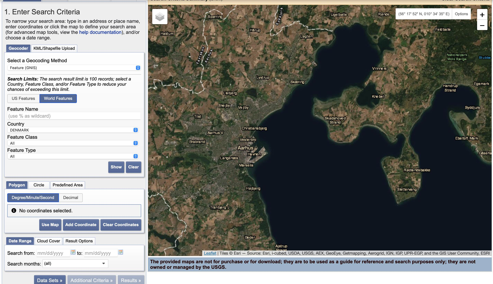
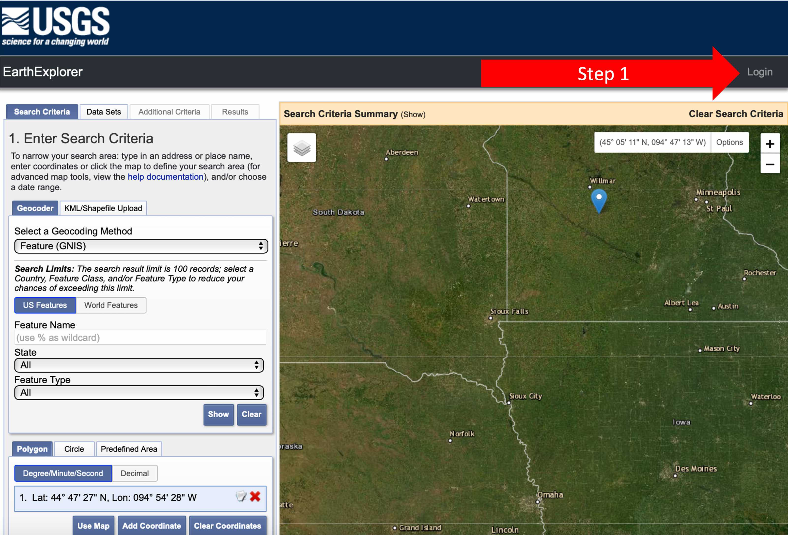
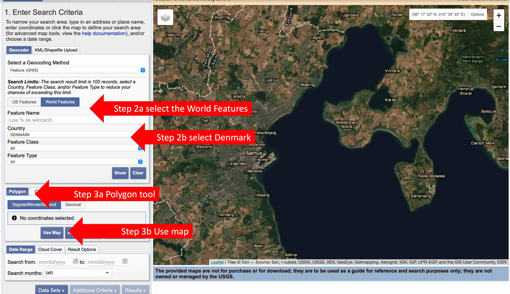
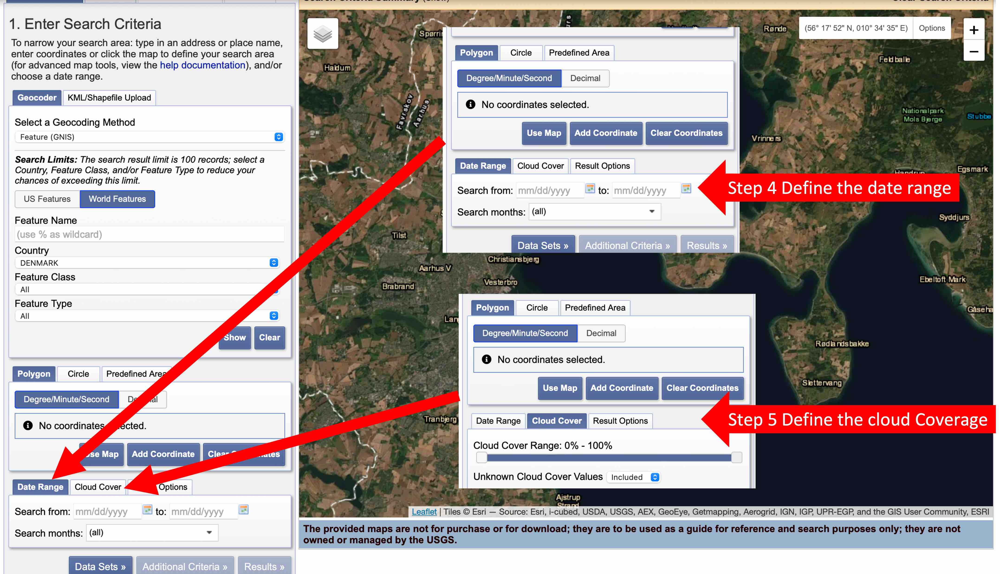
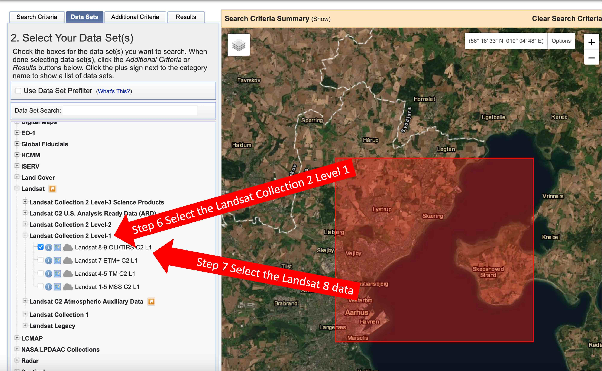
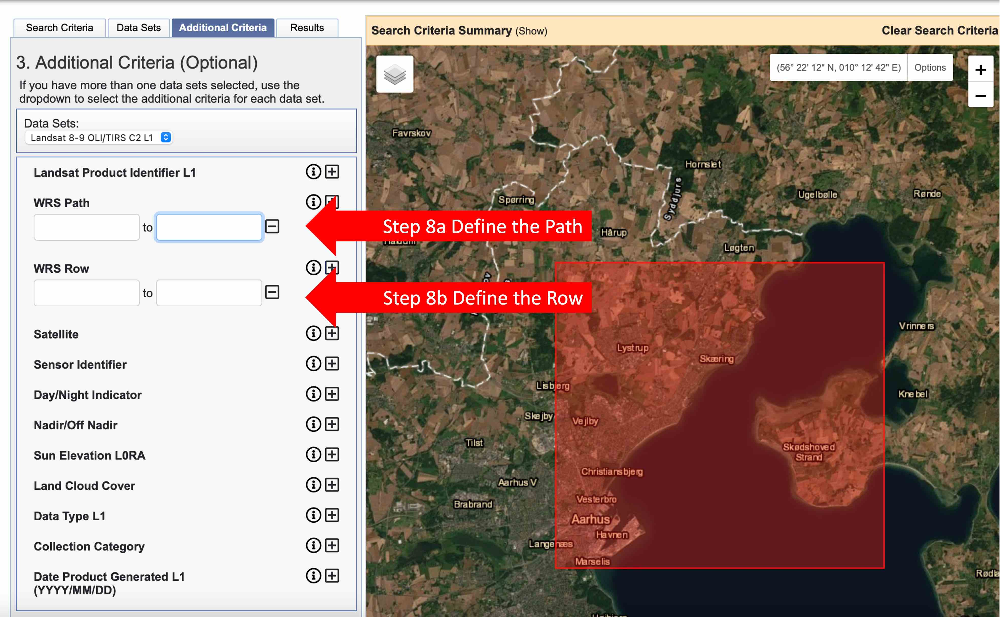
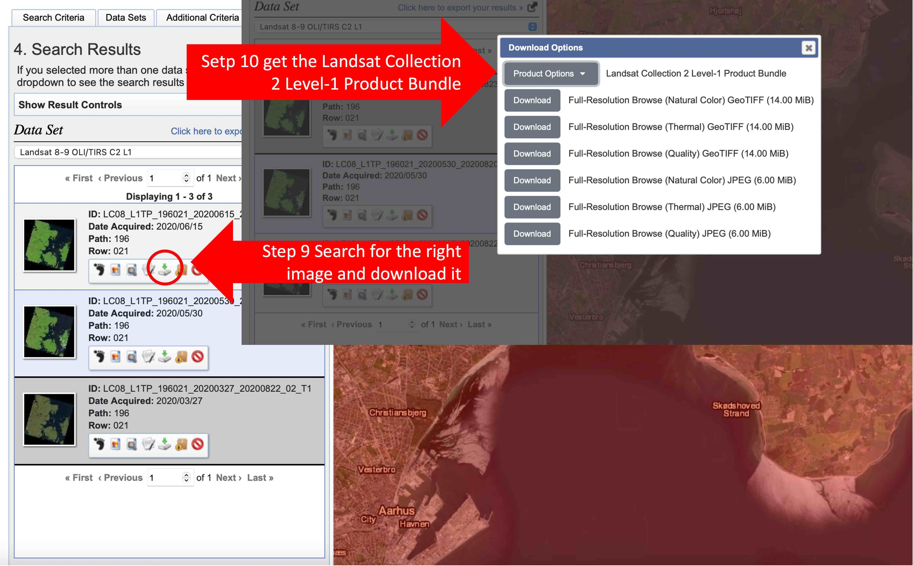

```{r setup, include=FALSE}
knitr::opts_chunk$set(echo = TRUE, fig.align = 'center')

#Load the Libraries
library(raster)
```

# Landsat Basics

This practical/tutorial covers the basic acquisition, import, and visualization of Landsat data in `R`.

Landsat is the name of a joint NASA/USGS program that provides repetitive, calibrated, satellite-based observations of the earth at a spatial resolution that enables analysis of man's interaction with the environment. (NASA 2021).

The Landsat 1 satellite was launched on 23 July 1972 and subsequent satellites have provided continuous satellite imagery of the Earth. This is arguably one of the most important scientific enterprises of our time, and if you work with remote sensing, you will probably use Landsat data on multiple occasions.

Landsat 7 (launched 1999) and Landsat 8 (launched 2013) are currently operational. Landsat 9  launched on 27 September 2021 replacing Landsat 7 with a satellite that is functionally similar to Landsat 8 (NASA 2020).

Landsat satellites complete just over 14 orbits a day, covering the entire earth every 16 days. Landsat satellites travel in a near-polar, sun-synchronous orbit so they spend as much time as possible looking at sunlit area.

](./Images/wrs2.gif){width=70%}

The USGS makes recent and historic Landsat data freely available via the [EarthExplorer](https://earthexplorer.usgs.gov) website. In order to download data from this website, you need to register (for free). Click the *Log-in* button and select **Create New Account**.

Now some lingo:

**Scenes** - Each Landsat image collected is a scene. Each Landsat scene is ~250km^2^. The globe is divided into 57,784 scenes, and each Landsat scene has about 3 billion bytes of data (~3GB). Scenes are designated by a path number (scanning path west to east) and row number (scene location on the path south to north). These are key to find which is the *scene* you need.

**Collections** - Landsat data has been released in two different collections, numbered one and two. Collection 2 incorporates the most recent processing enhancements to provide the best accuracy (USGS 2021).

**Levels** - Landsat data is also released at two different quality levels. Level-1 scenes are higher quality than Level-2 scenes.

**Sensors** - While historic scenes dating back to Landsat 1 (1972) are available from the multi-spectral scanner system carried on Landsat 1 to 4, this sensor had lower spatial resolution (68 m X 83 m) and lower spectral resolution (four bands) than the thematic mapper sensors (30 m resolution and seven bands) that were launched on Landsat 4 in 1982 and Landsat 5 in 1984. Therefore, unless you specifically need scenes from the 1970s, the oldest data you will probably want to use will be Landsat 4 or 5.

**Clouds** - Because Landsat only passes over any given location on the surface of the earth every 16 days, if that happens to be a cloudy day at your point of interest on the day of interest, you will be out of luck. Therefore finding a clear scene will often be a challenge, especially during winter in cloudy northern climates.

# Getting data using the *Earth Explorer*.

The first part of this tutorial is done outside `R`. Here, you will download  a cloud free Landsat 8 scene. This will take some time, and a subset of the data will be available for you to use for the next steps. But I encourage you do this so you understand how to get the satellite information you could need.

{width=70%}

So now you will get an image for the region encompassing Aarhus-Ebeltoff. For this, you will:

1) Log in to *Earth Explorer* - the top 

{width=70%}

2) To get data for a specific location, outside of the US select the **World Features** and select *Denmark*from the **Country* tab.

3) Using the map on the right side of the screen; navigate to the Aarhus-Ebeltoff region and using the **Polygon** tab select the **Use Map** to define the region from where you will get the Scenes

{width=70%}

4) Now on the **Date Range** tab select the *Start* (01/01/2019) and *End* (12/31/2019) date for your search.

5) For Cloud cover, define in the **Cloud** tab a range between 0% and 1%.

{width=70%}

Now you will move to the **Data set** set selection by pressing the **Data set>>** button.


6) Look for the *Landsat* folder in the structure and open the **Landsat Collection 2 Level 1** data set.

7) Select the **Landsat 8-9 OLI/TIRS C2 L1** Collection. This is the Landsat 8-9 Operational Land Imager (OLI) and Thermal Infrared Sensor (TIRS) Collection 2 Level-1 Collection.


{width=70%}


Now you will move to the **Additional Criteria** Tab to define the path and row for the region of interest.

8) Define the **WRS paths** to range between 196 and 196; and the **WRS Row** to range between 21 and 21.

{width=70%}

Now press **results** to move to the *Scenes* to download.

9) Look for the *LC08_L1TP_196021_20190629_20200827_02_T1* scene, and look for the download icon - press it.

10) You will be given many options to download, now press the **Product Options** and get the *Landsat Collection 2 Level-1 Product Bundle* as we will be doing a multi-band analysis. The Product Bundle data is a `.tar` archive containing *Geo Tiff* files for individual bands that can be extracted using a program like 7-zip.

{width=70%}

However, if you just need visible light imagery, the Full Resolution Browse (Natural Color) *Geo Tiff* is the simplest (single file) option. These *Geo Tiff* (`.tif`) files require no additional processing. 

11) Now create a new working directory and un-compress the data files into that directory.

# What did you download?

The product bundle from Earth Explorer is in a `.tar` archive file that contains a collection of band files. You may be able to extract the contents of the `.tar` archive simply by double-clicking the file.


Individual Landsat bands for a scene are placed in separate *Geo Tiff* files that are distinguished by the ends of their names. For example, for Landsat 8 level 1 data (LC08_L1TP), path 196 and row 21 (196021) on 29 June 2019 (20190629), the following files are data files for the 11 different bands

  1) LC08_L1TP_196021_20190629_20200827_02_T1_B1.TIF (coastal aerosol - ultraviolet)
  2) LC08_L1TP_196021_20190629_20200827_02_T1_B2.TIF (blue)
  3) LC08_L1TP_196021_20190629_20200827_02_T1_B3.TIF (green)
  4) LC08_L1TP_196021_20190629_20200827_02_T1_B4.TIF (red)
  5) LC08_L1TP_196021_20190629_20200827_02_T1_B5.TIF (near infrared)
  6) LC08_L1TP_196021_20190629_20200827_02_T1_B6.TIF (shortwave infrared 1)
  7) LC08_L1TP_196021_20190629_20200827_02_T1_B7.TIF (shortwave infrared 2)
  8) LC08_L1TP_196021_20190629_20200827_02_T1_B8.TIF (panchromatic)
  9) LC08_L1TP_196021_20190629_20200827_02_T1_B9.TIF (cirrus)
  10) LC08_L1TP_196021_20190629_20200827_02_T1_B10.TIF (thermal infrared 1)
  11) LC08_L1TP_196021_20190629_20200827_02_T1_B11.TIF (thermal infrared 2)

Additional *Geo Tiff* files provide more-detailed information about the data and data processing.

  12) LC08_L1TP_196021_20190629_20200827_02_T1_QA_PIXEL.TIF: Pixel quality adjustment band
  13) LC08_L1TP_196021_20190629_20200827_02_T1_QA_RADSAT.TIF: Radiometric saturation and terrain occlusion QA band
  14) LC08_L1TP_196021_20190629_20200827_02_T1_SAA.TIF: Solar azimuth angle
  15) LC08_L1TP_196021_20190629_20200827_02_T1_SZA.TIF: Solar zenith angle
  16) LC08_L1TP_196021_20190629_20200827_02_T1_VAA.TIF: Sensor azimuth angle
  17) LC08_L1TP_196021_20190629_20200827_02_T1_VZA.TIF: Sensor zenith angle


# Landsat 8 - RGB Visualization

Raster data in `R` is commonly handled with the `raster` package (or its newest iteration the `terra` package), which you can install with the function `install.packages()` before you use it the first time. 

```{r install, eval = F}
install.packages("raster")
```

The `raster` package provides three different raster structures that you choose from depending on how many bands you need for a scene, and how many files they come from:

  * `raster()` = one file, one band.
  
  * `brick()` = one file, multiple bands (Commonly used with RGB images).
  
  * `stack()` = multiple files, multiple bands (Landsat Geo Tiffs).

Now to visualize the Data you will create a `RasterStack` for a visible light  scene. For this you will:

1) Create three `raster()`; one for the red, green, and blue band files.
2) Combine those into a single `RasterStack`object.
3) Use the function `plotRGB()` to display the stack. Here, the `scale=65535` parameter is needed because Landsat 8 data is published with 16-bit values that range from 0 to 65535.

```{r RGBPLot}

blue <- raster("./DataLS8/LC08_L1TP_196021_20190629_20200827_02_T1_B2.TIF") # Load the Blue Band
green <- raster("./DataLS8/LC08_L1TP_196021_20190629_20200827_02_T1_B3.TIF") # Load the Green Band
red <- raster("./DataLS8/LC08_L1TP_196021_20190629_20200827_02_T1_B4.TIF")# Load the Red Band

rgb.Scene <- stack(red, green, blue) # Stack the Blue, Green & Red Bands

# Plot the three bands into a single composite 
plotRGB(rgb.Scene, # RasterStack with all the bands
        r = 1, # Index of the Red channel in the RasterStack
        g =2, # Index of the Green channel in the RasterStack
        b= 3, # Index of the Blue channel in the RasterStack
        scale = 65535, # Maximum (possible) value in the three channels
        axes=TRUE, main="Landsat Scene" # add a title
        )
```

Because the Landsat sensors have a wide dynamic range to be able to handle a variety of different terrains, the values for a scene may be in the low range of potential values, which will result in a very dark visualization.

# Croping the Landsat image

Landsat scenes cover a land area of over <200 km^2^, which, along with the dark rendering, can make it difficult to distinguish what locations are being displayed.

As our focus is on a fairly small area within the scene, cropping the scene will both make it easier to see where you are, and will reduce the memory needed to process the scene further.

Now to crop the scene to the area of interest you will:

1) Create an empty raster using the function `raster()`. Here you will define the top left (`ymx` and `xmn`) and bottom right (`ymn` and `xmx`) lat/long coordinates.

2) Use the function `projectRaster()` to define the projection of the empty raster to that of the Landsat scene.

3) Using the function `crop()` you will create a new raster that focuses only in the projected extent.

4) You will finish by plotting the cropped `rasterStack` using the function `plotRGB()`.

```{r cropRaster}
# Define a raster with the boundary of the area of interest
boundary = raster(ymx=56.20, # maximum y coordinate (top border)
                  xmn=10.09, # minimum x coordinate (left border) 
                  ymn=56.10, #minimum y coordinate (bottom border)
                  xmx=10.29 # maximum x coordinate (right border)
                  )
# Project the boundary area
boundary = projectExtent(object = boundary, # Raster* object
                         crs = rgb.Scene@crs # Raster* object with the parameters to which 'from' should be projected 
                         )
# Crop the Landsat image
AarhusReg = crop(x = rgb.Scene, # Raster* object
                 y = boundary # Extent object
                 )
# Plot the RGB composite
plotRGB(AarhusReg, # Cropped RasterStack
         r = 1, # Index of the Red channel in the RasterStack
        g =2, # Index of the Green channel in the RasterStack
        b= 3, # Index of the Blue channel in the RasterStack
        scale = 65535, # Maximum (possible) value in the three channels
        axes=TRUE, main="Landsat - Aarhus"# add a title
        )
```


# Improving the visualiztion  

When the range of pixel brightness values is closer to 0, a darker image is rendered by default. When the range of pixel brightness values is closer to 255, a lighter image is rendered by default. on either case, you can stretch the values to extend to the full 0-255 range of potential values to increase the visual contrast of the image. For this you need set the he `stretch` argument of the function `plotRGB()`. Setting `stretch= "lin"` stretches the values evenly from the minimum to the minimum. Setting `stretch= "hist"` distributes them more evenly across the range. Doing this, can improve the rendering of the scene. 

In both cases with this particular scene, the results make features more visible, but the visual contrast is harsh and, arguably, unappealing.

Now plot the image by defining a:

1) Linear stretching.

2) Histogram stretching.

```{r strech}
# Linear stretching - re-scale fo the max value is 1 and the min value is 0
plotRGB(AarhusReg, # Cropped RasterStack
         r = 1, # Index of the Red channel in the RasterStack
        g =2, # Index of the Green channel in the RasterStack
        b= 3, # Index of the Blue channel in the RasterStack
        scale = 65535, # Maximum (possible) value in the three channels
        stretch="lin", # How to stretch the values to increase the contrast of the image
         axes=TRUE, main="Landsat - Aarhus\n Linear stretch "# add a title
        )

# Histogram stretching - even spacing across the range
plotRGB(AarhusReg, # Cropped RasterStack
         r = 1, # Index of the Red channel in the RasterStack
        g =2, # Index of the Green channel in the RasterStack
        b= 3, # Index of the Blue channel in the RasterStack
        scale = 65535, # Maximum (possible) value in the three channels
        stretch = "hist", # How to stretch the values to increase the contrast of the image
         axes=TRUE, main="Landsat - Aarhus\n histogram stretch "# add a title
        )
```

You can also define the stretching manual by defining both the `scale` argument (the maximum value possible) and the `zlim` argument (defines the range of values that can be processed) on the function `plotRGB()`.

Now to do this:

1) Do a histogram on the `AarhusReg` `RasterStack` to define the range of values to plot (the `zlim` argument). Also, explore the percentiles using the function `quantile()`.
2) Remove the lowest values by substantiating 5000 from all scenes.
3) Use the function `plotRGB()` to plot the `AarhusReg` `RasterStack`, defining the `scale` and `zlim` arguments

```{r CustStrechHIst}
# Plot the histograms per band
hist(AarhusReg)
# Assess the percentiles per band
quantile(AarhusReg,c(0,.5,.75,.90,1))
```

```{r CustStrechRGB}
# Plot the RGB composite
plotRGB(AarhusReg - 7000, # Remove the largest of the lowest values so the lowest value in the RasterStack is Zero.
        scale=10000, # Maximum (possible) value in the three channels - the max 90-percentile
        zlim=c(0, 10000), # Range of values to plot
        axes=TRUE, main="Landsat - Aarhus\n Custom stretch "# add a title
        )
```

You can also use non-linear stretching [Gamma correction](https://en.wikipedia.org/wiki/Gamma_correction) which means transforming the band values using exponents. Values below one increase the curve shift and values above one decrease the shift.

Now do a `Gamma correction` of the `AarhusReg` object, and plot it using the function `plotRBG()`.

```{r GammaCorr}
# Gamma correction
blue <- AarhusReg[[3]]
green <- AarhusReg[[2]]
red <- AarhusReg[[1]]

# Re-scale the values
blue <- ((blue - 7000) / 10000) 
green <- ((green - 7000) / 10000)
red <- ((red - 7000) / 10000)

# Make negative values Zero
blue[blue < 0] <- 0
green[green < 0] <- 0
red[red < 0] <- 0

# Do a Gamma-transformation
blue.Gamma <- blue^0.95
green.Gamma <- green^0.5
red.Gamma <- red^0.5

# Stack the image
rgb.Gamma <- stack(red.Gamma,
                  green.Gamma,
                  blue.Gamma)

# Plot the RGB composite
plotRGB(rgb.Gamma, # RasterStack
        scale=1, # Maximum (possible) value in the three channels
        zlim=c(0, 1), # Range of values to plot
        axes=TRUE, main="Landsat - Aarhus\n Gamma stretch "# add a title
        )
```


# Natural Color Images

Your can also download a pre-processed three-band composite RGB files that can be used  directly without having to combined band files or perform additional correction. These are the Full-Resolution Browse (Natural Color) *Geo Tiff* files. These are actually false-color images (more n these alter in the practical) constructed with the infrared and red bands, but in they often render well in RGB and require much less work to use than stacks constructed from band files.

Because the natural color scenes are in single composite files, use the function `brick()` to load the image into memory and the function to `plotRGB()` to display the brick as a single image. 

Now plot the Natural Color Image, for this:

1) Crop the Natural Color image using the procedure described above.

2) Plot the RBG composite of the Cropped Natural Color Image.

```{r NatColImgPlot}
# Load the Natural Color Image
rgb.Nat.Color <- stack("./DataLS8/LC08_L1TP_196021_20190629_20200827_02_T1_refl.TIF")

# crop the Natural Color Image using the boundary raster
rgb.Nat.Color <- crop(x = rgb.Nat.Color, # Raster* object to crop
                      y = boundary # Extent object
                      )

#plot the RGB composite
plotRGB(rgb.Nat.Color, # RasterStack
        axes=T, main = "Landsat - Aarhus\nNatural Color Image", # Add main title
        )
```

# Beyound the Red-Green-Blue combiation 

Although RGB is the most obvious band combination for Landsat data, the comparatively low resolution (30 meters) severely limits visible light image quality compared to other contemporary high-resolution sources, especially when focusing on localities.

However, data from the eight other infrared and ultraviolet bands can be combined with the visible light bands in a variety of ways to create useful visualizations for bio geography and agriculture- Information on these combinations is available [HERE](https://gisgeography.com/Landsat-8-bands-combinations/), and you will now explore some of these.

**Color Infrared** This band combination is also called the near-infrared (NIR) composite. It uses colors near-infrared (band 5) as red, red (band 4) as green, and green (band 3) as blue. Because chlorophyll reflects near-infrared light, this band composition is useful for analyzing vegetation. In particular, areas in red have better vegetation health. Dark areas are water and urban areas are white.

Now plot the Color Infrared combination:

```{r colorInfRed}
# Load the near infrared Raster
near.infrared <- raster("./DataLS8/LC08_L1TP_196021_20190629_20200827_02_T1_B5.TIF")

# Crop the near infrared Raster
near.infrared <- crop(x = near.infrared, # Raster* object to crop
                     y = boundary # Extent object
                     )

# Create a raster stack with the bands for a Color Infrared combination
rgb.ColInf <- stack(near.infrared, # near infrared
                   AarhusReg[[1]], # red
                   AarhusReg[[2]] # green
                   )

# Plot the Color Infrared combination raster stack
plotRGB(rgb.ColInf, # RasterStack
        r = 1, # Index of the Red channel in the RasterStack
        g = 2, # Index of the Green channel in the RasterStack
        b = 3, # Index of the Blue channel in the RasterStack
        scale = 65535, # Maximum (possible) value in the three channels
        stretch = "lin", # How to stretch the values to increase the contrast of the image
        axes =TRUE, main = "Landsat - Aarhus\n Color Infrared "# add a title
        )
```


**Short-Wave Infrared**: The short-wave infrared band combination uses SWIR-2 (band 7) as red, SWIR-1 (band 6) and green, and red (band 4) as blue. This composite displays vegetation in shades of green. While darker shades of green indicate denser vegetation, sparse vegetation has lighter shades. Urban areas are blue and soils have various shades of brown.

Now plot the Short-Wave Infrared combination:

```{r SrtWav}
# Load the Short-Wave Infrared 1
sw.infrared.1 <- raster("./DataLS8/LC08_L1TP_196021_20190629_20200827_02_T1_B6.TIF")
# Crop the Short-Wave Infrared 1
sw.infrared.1 <- crop(x = sw.infrared.1, # Raster* object to crop
                     y = boundary # Extent object
                     )

# Load the Short-Wave Infrared 2
sw.infrared.2 <- raster("./DataLS8/LC08_L1TP_196021_20190629_20200827_02_T1_B7.TIF")
# Crop the Short-Wave Infrared 2
sw.infrared.2 <- crop(x = sw.infrared.2, # Raster* object to crop
                     y = boundary # Extent object
                     )

# Create a raster stack with the bands for a Short-Wave Infrared combination
rgb.SwInf <- stack(sw.infrared.1, # Short-Wave Infrared 1
                  sw.infrared.2, # Short-Wave Infrared 2
                  AarhusReg[[1]] # red
                  )

# Plot the Short-Wave Infrared combination raster stack
plotRGB(rgb.SwInf, # RasterStack
        r = 1, # Index of the Red channel in the RasterStack
        g =2, # Index of the Green channel in the RasterStack
        b = 3, # Index of the Blue channel in the RasterStack
        scale = 65535, # Maximum (possible) value in the three channels
        stretch = "lin", # How to stretch the values to increase the contrast of the image
        axes =TRUE, main = "Landsat - Aarhus\n Short-Wave Infrared "# add a title
        )
```

**Agriculture**: This band combination uses SWIR-1 (band 6) as red, near-infrared (band 5) as blue, and blue (band 2) as green. It’s commonly used for crop monitoring because of the use of short-wave and near-infrared. Healthy vegetation appears dark green. But bare earth has a magenta hue.


Now plot the Agriculture combination:

```{r Agriculture}
# Create a raster stack with the bands for a Agriculture combination
rgb.Agro <- stack(sw.infrared.1, # Short-Wave Infrared 1
                  near.infrared, # near infrared
                  AarhusReg[[3]] # blue
                  )
# Plot the Agriculture combination raster stack
plotRGB(rgb.Agro, # RasterStack
        r = 1, # Index of the Red channel in the RasterStack
        g = 2, # Index of the Green channel in the RasterStack
        b = 3, # Index of the Blue channel in the RasterStack
        scale = 65535, # Maximum (possible) value in the three channels
        stretch = "lin", # How to stretch the values to increase the contrast of the image
        axes = TRUE, main = "Landsat - Aarhus\n Agriculture "# add a title
        )

```

**Geology**: The geology band combination uses SWIR-2 (band 7) and red, SWIR-1 (band 6) and green, and blue (band 2) as green. This band combination is particularly useful for identifying geological formations, lithology features, and faults.

Now plot the Geology combination:

```{r Geology}
# Create a raster stack with the bands for a Geology combination
rgb.Geo <- stack(sw.infrared.2, # Short-Wave Infrared 2
                sw.infrared.1, # Short-Wave Infrared 1
                AarhusReg[[3]] # blue
                )
# Plot the Geology combination raster stack
plotRGB(rgb.Geo, # RasterStack
        r = 1, # Index of the Red channel in the RasterStack
        g = 2, # Index of the Green channel in the RasterStack
        b = 3, # Index of the Blue channel in the RasterStack
        scale = 65535, # Maximum (possible) value in the three channels
        stretch = "lin", # How to stretch the values to increase the contrast of the image
        axes = TRUE, main = "Landsat - Aarhus\n Geology "# add a title
        )
```

**Bathymetric**: The bathymetric band combination uses the red (band 4) as red, green (band 3) and green, and coastal bands (band 1) and green to peak into water. The coastal band is useful in coastal, bathymetric, and aerosol studies because it reflects blues and violets. This band combination is good for estimating suspended sediment in the water.

Now plot the Bathymetric combination:

```{r Bathymetric}
# Load the near infrared Raster
coastal.bands <- raster("./DataLS8/LC08_L1TP_196021_20190629_20200827_02_T1_B1.TIF")

# Crop the coastal bands Raster
coastal.bands <- crop(x = coastal.bands, # Raster* object to crop
                     y = boundary # Extent object
                     )

# Create a raster stack with the bands for a Bathymetric combination
rgb.Bati <- stack(AarhusReg[[1]], # red
                   AarhusReg[[2]], # green
                   coastal.bands # coastal bands
                   )

# Plot the Bathymetric combination raster stack
plotRGB(rgb.Bati, # RasterStack
        r = 1, # Index of the Red channel in the RasterStack
        g = 2, # Index of the Green channel in the RasterStack
        b = 3, # Index of the Blue channel in the RasterStack
        scale = 65535, # Maximum (possible) value in the three channels
        stretch = "lin", # How to stretch the values to increase the contrast of the image
        axes = TRUE, main = "Landsat - Aarhus\n Bathymetric "# add a title
        )
```


# Vegetation Index

Vegetation indexes leverages the properties of the red (which vegetation absorbs) and near-infrared bands (which vegetation strongly reflects). As the name implies, we use it to monitor vegetation health and vigor. 


Normalized Difference Vegetation Index [(NDVI)](https://gisgeography.com/ndvi-normalized-difference-vegetation-index/) is one of these indices that indicate the level of photosynthetic vegetation. NDVI is based on the observation that green plants reflect infrared light (to avoid overheating), but absorb visible light (to power photosynthesis). This gives green plants a light reflection signature that can distinguish them from objects that absorb all spectra of light or different spectra of light from plants.

NDVI is calculated by combining the red and near infrared bands using the following formula:
$NDVI = \frac{infrared - red}{infrared + red}$

NDVI values always ranges from -1 to +1. Negative values are indicative of water and moisture. But high NDVI values suggest a dense vegetation canopy.

While you could use the level of green light to detect green (photosynthetic) plants, the level of green light depends on the intensity and angle of the sun relative to the terrain. The use of this combination of red and near-infrared gives measurements that are normalized to be the consistent across time and space regardless of terrain or level of lighting.

Now you will estimate NDVI for the area of interest. For this you will use map algebra based on the red (`AarhusReg[[1]]`) and near infrared (`near.infrared`) objects. 

```{r NDVI}
# Estimate NDVI
NDVI <- (near.infrared - AarhusReg[[1]]) / (near.infrared + AarhusReg[[1]])

# Define a color palette that goes from red to dark cyan
# The colorRampPalette() is used to define 255 colors that are then passed with the raster to plot() a visualization of the NDVI raster.
colors <- colorRampPalette(c("red3", "white", "darkcyan"))(255)

# pot the NDVI 
plot(NDVI, # raster object
     zlim = c(0, 0.6), # Range of values to plot 
     col = colors, # the color ramp
     colNA = "black", # Make NA values Black
     main = "NDVI - Aarhus" # Add a title
     )
```


# Analyzing NDVI Change

The same type of raster algebra used to calculate NDVI can be used to calculate changes in NDVI between scenes.

When looking for a scene for for comparison a different date, it is important that you use an image from the same path and row. Although Landsat scenes overlap, using the same path and row will maximize the amount of common area and, therefore the amount of area covered in the analysis.

This example displays changes in NDVI in the Aarhus region between a 1984 Landsat 5 scene and the 2019 Landsat 8 scene you worked with until now.

Now estimate the change in NDVI between the two time periods.

```{r NDVIChange}
# Load the red band for 1984
red.1984 <- raster("./DataLS5/LT05_L1TP_196021_19840425_20200918_02_T1_B4.TIF")
#Crop the Red Band raster
red.1984 <- crop(red.1984,
                boundary)

# Load the near.infrared band for 1984
near.infrared.1984 <- raster("./DataLS5/LT05_L1TP_196021_19840425_20200918_02_T1_B5.TIF")
#Crop the near.infrared Band raster
near.infrared.1984 <- crop(near.infrared.1984,
                      boundary)

# Estimate NDVI for 1984
NDVI.1984 <- (near.infrared.1984 - red.1984) / (near.infrared.1984 + red.1984)

# Estimate the NDVI difference
NDVI.difference <- NDVI - NDVI.1984

# Define a color palette that goes from red to dark cyan
# The colorRampPalette() is used to define 255 colors that are then passed with the raster to plot() a visualization of the NDVI raster.
colors <- colorRampPalette(c("red3", "white", "darkcyan"))(255)

# pot the NDVI 
plot(NDVI.difference, # raster object
     zlim = c(0, 0.6), # Range of values to plot 
     col = colors, # the color ramp
     colNA = "black", # Make NA values Black
     main = "NDVI Difference - Aarhus/n[2019 - 1984]" # Add a title
     )
```

While the urbanized areas seem largely unchanged, the surrounding area has noticeably lower NDVI, which reflects both the construction of residential developments on the edge of the city (sprawl), and may reflect decreased agricultural intensity in the areas around Aarhus, which is noticeable by comparing the visible light visualizations above. However, this may also reflect differences in the sensor hardware.


# Last points.

There is much more you could do to visualize and summarize Satellite information in `R`. For example you could blend the images  with a base map for context or create interactive maps. I would leave that to the interested student.

In the next weeks you will evaluate the relation between bands, and extract the information of different indices (e.g., NDVI) and individual bands for to classify the image into discrete classes). 


